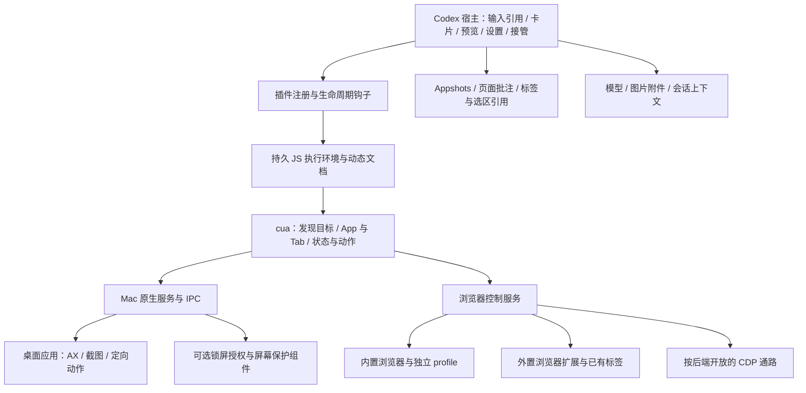

# Codex Computer Use 对标基线

2026-09-11 · **实现未完成；已恢复开发，现有版本已启动，输入区提供常驻 Computer Use 入口。** 当前交接入口见 [COMPUTER_USE_HANDOFF.md](COMPUTER_USE_HANDOFF.md)。

目标：让 trisoulx 获得尽可能接近 Codex 的 Computer Use 能力和使用体验。插件整体新写，Vibex 只提供经验与测试场景。本文描述要对齐的用户行为与接口；原生服务内部不可见的实现不作猜测。

## 最新视觉约定（2026-09-12）

用户明确选择 DSH 与 Codex 的融合风格，并授权调整全部前端。此次改版保留 DSH 主框架和蓝色强调，统一对话工具栏、侧栏工作台、设置、批注与悬浮预览；不以整套像素复刻作为本次视觉交付要求。原有操控能力、可靠性、平台及未验收项继续保留，详见交接最新条目。

## 用户确认的范围调整（2026-09-11）

以下四类移到最后的可选探索，当前不开发、不作为交付门槛，也不计入当前完成度；以后由用户另行决定是否启动。历史记录与此冲突时，以本次范围调整为准。

- ChatGPT 账号、会话同步、云端 Work、手机远程任务体系；使用 TrisoulX／DSH 现有模型、会话和任务机制。
- ChatGPT 专用 Excel／PowerPoint add-in 及官方连接器生态；通过界面操控这些应用仍须实现和验证。
- 浏览器扩展中的 ChatGPT 侧边聊天、历史聊天同步；连接已有浏览器、标签／选区引用和页面操控仍保留。
- Codex 插件市场、内部注册方式与专属组件包装的复刻；采用 DSH 插件机制，TrisoulX 自有运行时的安装、更新、卸载仍保留。

其余已讨论范围继续保留，包括 Appshots 式窗口分享、页面批注／素材／导出／WebMCP、Windows、锁屏使用，以及完整操作 UI、实时画面、小鼠标、停止／接管、可靠性和速度对照。后续继续按此范围推进，无需返回旧对话确认。

此前口头报告的 60%／65% 为无完整验收权重的粗估，已撤回，不作为交接进度依据。交接时区分已经实现、实测覆盖和仍缺项，不由删除生态项目或测试通过数量推算完成率。

此前的 [搬运／重写评估](/Users/mac/Projects/trisoul_x/COMPUTER_USE_ASSESSMENT.md) 只能支持代码取舍，不能替代本基线。最初的开工阶段只做了工具链和权限探测；目前已进入实现和真实测试，进度见文末。

C01／C21 常驻入口、连续 CU 默认收起及截图按需展开已交付，两种浏览器后端 UI 回归通过。C09／C14 已补 QQ 惰性 AX、匹配窗口下的无控件焦点输入和网页后台焦点清理；实际 QQ 搜索输入／恢复通过，尚不代表 QQ 全任务完成。C10 新增仅文本模型提示与大 AX 分段读取。B05 添加交付页标记提醒后，真实 v41 浏览器任务正确保留结果页、0 工具错误；新增原生网页焦点实测最终输入保存正确，但有恢复和模型误调用，速度／稳定性仍待改进。最新证据、未通过项与下一步见交接文档开头。 C02 已修复运行进程缓存旧源码安装指纹；H06 已增加完整操作计数，长任务截断最近记录后仍能核算早期失败与输入方法。开发／人工验收分工以交接最新条目为准，外观对照继续由助手负责。

B14／B16 新增当前页 MHTML 导出与素材清单／保存，接入 DSH 持久文件附件并验证默认折叠及重载；B15 新增 Chromium 原生 WebMCP 工具句柄、失效与取消重试，在兼容 Chromium 153 上验证两种后端。当前系统 Chrome 已更新至 153.0.8010.37，WebMCP 取消回归与真实模型专项已通过；旧版不静默换后端。专用文档导出、跨框架／流媒体、WebMCP 声明式边界仍未完成。最新证据与钥匙串测试干扰见交接开头。

H03 新增输入区“分享窗口”：所选 Mac 窗口截图与文字进入当前草稿，独立只读会话不取得模型输入租约；真实原生和 DSH UI 验证通过。全局 Appshots 快捷键及前台上下文入口仍待实现，C09 标题栏匿名 AX 节点的差量噪声保留为缺项。

B19 新增浏览器面板“批注页面”：冻结预览、圈选区域、用户说明、带蓝框 PNG 与上下文 TXT 加入当前草稿；两种浏览器实际 DSH 发送链路通过，模型请求收到图片和文字附件。取消及跨会话编码清理已验证，深色／窄窗截图已复核，主按钮保持可见。元素选择的后续进展见下条，样式调整预览及完整 Codex UI 对照仍未完成。

B19 进一步接入主文档／shadow DOM 元素选择：独立观察连接采集 DOM 与 PNG 并核对前后状态，保留控件身份、祖先和计算样式；两种后端原生浏览器及实际 DSH UI 已通过。支持滚动容器裁剪和缩放坐标。子框架内部、复杂非矩形裁剪／遮挡、样式修改预览及完整 UI 对照仍未完成；详见交接最新条目。

B19 已继续实现真实页面样式预览：暂停助手、临时应用 CSS、采集 PNG 后恢复，将效果图和拟议修改加入草稿。两后端颜色像素、恢复／取消／失败重试及 DSH 发送验证通过，恢复未确认时不继续控制。当前主要样式字段已接入；子框架、复杂命中、完整 UI 与真实模型反馈任务验收仍待推进。

B19 子框架已接入同源／跨源嵌套、独立进程、边框／padding、旋转／透视、内外滚动和 pinch 缩放；按内容四角映射多边形，并保留外层遮挡顺序及对应框架的样式恢复。实际 DSH 框架批注和官方 v41 文字批注任务通过（36.484 秒、0 工具错误／旁路、外层未改）。仍缺任意 CSS mask／clip-path 等复杂命中和完整 Codex UI／速度 A/B 对照，完整目标没有完成。

C07／C16／C21／C24 本轮额度收尾：增加重启后的运行时上下文通知、AX 赋值延迟回退检查、紧凑蓝色 UI，以及 Document Picture-in-Picture 悬浮观察窗（网页／Mac 应用、实时画面、小鼠标、停止）。隔离延迟回退与真实 DSH 原生悬浮窗已验证；QQ 完整发送任务、Windows、完整 Codex UI／速度对照仍未验收。用户要求此版本暂时上线，其余范围保留但暂停扩展，详见交接开头。

C21／C24 按用户最新描述改为对话页内自动出现的视频式堆叠预览：多个目标持续更新，点击进入原应用窗口或对应网页，输入区保持可用。独立 PiP 保留为可选。双原生应用实际前台切换、页内位置与停止后预览已验证；精确 Codex 像素对照仍无实物证据。

## 什么算“完整”

完整须相对于**指定版本、平台、启用的后端和用户可见行为**判断，不能只列点击／输入几个工具，也不能把包中所有未启用方法算成当前能力。

- 基线版本：本机 unified-computer-use `26.903.61454`；Browser 随附包 `0.1.1`；原生服务 `26.902.1000968`（build `1000968`）；官方在线说明作为补充，和本地不一致时保留冲突。
- 初始核查调用 `cua.getState()` 并读取内置浏览器文档；之后已使用自有浏览器和原生 AppKit 测试页面做 Codex 对照。外置 Chrome 扩展已连接，但完整交互流程仍待实测。
- 状态用语：**接口确认**＝本轮工具动态文档；**代码确认**＝已读本地实现／类型／配置；**官方说明**＝公开产品说明；**待实测**＝具体运行行为尚无本轮证据；**冲突待解**＝资料互相矛盾。
- 接口确认不等于全链执行成功，官方说明不等于本机所有选项都已启用。任何未实现、未验证或后端不支持的项都须显式列出，不可在“基本完成”里消失。

## 组成与职责

这是功能职责图，不宣称每个框都是单独进程。安装包已确认包含 `SkyComputerUseService`、`SkyComputerUseClient.app`、`CUALockScreenGuardian.app`，同时有宿主内的 JS 运行时和浏览器服务。各原生组件的全部内部职责尚未确认。

## 核心行为清单

每一行都需要实现落点和验证证据才能销项。下面状态描述的是对参照对象的了解程度；当前实现进度记录在文末，不能由接口存在推断已通过验收。

| 编号 | 对标部分 | 需要覆盖的具体行为 | 参照证据／尚缺内容 | 验收方法 |
| --- | --- | --- | --- | --- |
| C01 | 安装与启用 | 插件注册、启停、依赖组件、卸载、首次启用指引 | 本地 manifest 和原生版本已读；完整新机流程待实测 | 干净用户环境安装→启用→卸载，不留下后台控制进程 |
| C02 | 原生服务包装 | 固定应用身份、启动、连接、协议版本、崩溃与重连、更新 | 已见原生 bundle／IPC 错误协议／更新字段；更新及崩溃行为待实测 | 组件版本不匹配、重启、更新后权限与状态逐项检查 |
| C03 | 系统权限 | 辅助功能与录屏授权区分、未授权提示、撤销后行为 | 本机两项授权与重编译后保留已实测；分别撤销与完整指引仍待验收 | 分别撤销一项权限，验证准确提示与后续恢复 |
| C04 | 应用访问 | 应用选择、允许本次／以后允许、撤销、拒绝 | 官方说明；当前宿主具体卡片与分支待看图核对 | 同一 app 新会话、拒绝、撤销后的请求路径 |
| C05 | 输入引用 | `@App`、`@Browser`、外置浏览器与准确标签引用 | 动态文档与静态引用格式确认；UI 待对照 | 引用进上下文，重名／旧标签／浏览器重启不能换目标 |
| C06 | 目标发现 | app 名／路径／bundle ID，运行状态；浏览器／profile／标签清单 | 动态清单与接口确认；多实例解析待实测 | 同名不同实例、多窗、关闭重开、后台启动 |
| C07 | 持久 JS 环境 | 变量与对象跨调用保留、初始化文档、批量确定动作、错误结果、reset | 当前工具实测初始化；reset 说明为清变量、不关 app/tab | 两次调用复用绑定；reset 后重建绑定且目标内容不丢 |
| C08 | 生命周期身份 | session/turn/request 与目标所有权、并发冲突、结束清理 | 浏览器代码和 hooks 确认；Mac 原生停止算法不可见 | 同一目标两会话冲突、回合结束、异常结束、资源回收 |
| C09 | 结构化观察 | AX 全量与差量、元素编号、动作列表、标题／URL、截断／不可读提示 | 动态接口和浏览器代码确认；原生树构建内部不可见 | 属性增删、列表更新、失效引用、不同 app 的树输出 |
| C10 | 视觉观察 | 截图、AX+截图同次返回、真实图片进模型、尺寸／坐标对应 | 动态接口确认；浏览器还支持裁剪／全页 | 浏览器请求预览、页面／双指缩放、平移及部分旧图拒绝已有实测；多屏、移窗、遮挡、全部裁剪／全页和跨重启映射仍需分别验证 |
| C11 | 稳定等待 | 动作后自动等状态稳定、导航换代与截图提交一致性 | 浏览器实现确认；Mac 仅说明与接口证据 | 迟加载、弹窗、动画、跳转中观察、超时返回 |
| C12 | 点击 | 元素／坐标；左中右键；多击次数 | 动态接口确认 | 语义及像素两路，双击、右键、不可点击／遮挡／歧义 |
| C13 | 拖拽 | 起止点、过程动作、停止与鼠标释放 | 动态接口及服务 drag_start/move/end 协议存在 | 普通拖拽与途中取消，之后人工点击不残留按下态 |
| C14 | 键盘 | xdotool 风格组合键、导航键、数字键盘、中文输入、换行语义 | 动态说明确认；键入行为待逐 app 验证 | 组合键、输入法、多行、发送型输入框、持续按键取消 |
| C15 | 滚动 | 指定元素或坐标，四方向与页数 | 动态接口确认 | 嵌套滚动区、横向、多页、到边界后的反馈 |
| C16 | 文本选择与赋值 | `setValue`；按文本+前后缀选中或把光标放前／后 | 动态接口确认 | 重复文本消歧、全量替换、只读字段、插入位置 |
| C17 | 粘贴 | text/md/html；格式；剪贴板读取／覆盖／恢复区别 | **动态说明确认桌面 paste 恢复剪贴板；浏览器 paste 不恢复且 md 按纯文本插入。** 具体原生 md 渲染待实测 | 格式与文本都比对；人工同时复制、取消、不同后端分别验证 |
| C18 | 附加 AX 动作 | 从观察中已有动作执行展开、菜单、增减、取消等 | 动态接口确认；不能猜动作名称 | 展开／折叠、菜单与控件值；不支持时准确失败 |
| C19 | 后台运行 | app 后台启动与操作、用户同时使用别的 app | 官方说明；本轮未做真实背景 A/B | 记录目标效果、前台、指针、用户输入去向与剪贴板，不只看动作回执 |
| C20 | 停止与接管 | 对话停止、插件／扩展停止、用户介入、错误反馈、恢复控制 | hooks、错误协议与动态说明；停止延迟／恢复细节待实测 | 动作在途／排队／拖拽／录制状态下逐项停止，无后续自动动作 |
| C21 | 操作展示 | 调用卡片、状态文案、画面预览、目标应用可见标记、失败解释 | 官方说明与宿主扩展条件；当前准确布局和全部文案待看图 | 用相同任务逐屏对照，包括加载、错误、停止和恢复状态 |
| C22 | 锁屏使用 | 显式启用、授权插件、受控临时解锁、屏幕遮蔽、人工输入重锁 | 官方说明；原生组件存在；完整行为与实现待验证 | 专门测试环境演练锁屏→任务→介入→重锁，不能在用户日用会话随意改系统策略 |
| C23 | 运行环境区别 | 本地／远程设备；Mac 背景与 Windows 前台能力；离线与锁屏 | 官方说明；本机只核对 Mac 当前统一接口 | 按真实平台列支持项；不能把 Mac 结果当 Windows 已完成 |
| C24 | 助手小鼠标 | 箭头外观、实际位置与移动、点击／拖拽反馈；停止、接管、恢复、切页及回合结束 | 已从隔离 Chrome 页面实拍 Codex 的小黑箭头、白色描边与阴影；TrisoulX 的浏览器预览、外置 Chrome 与原生窗口基础光标已有真实动作和像素检查，原生前后台遮挡与焦点通过隔离双应用验证 | 原生拖拽动画／多屏、强制断连后快速重连、JavaScript 弹窗期间的即时隐藏、完整显示时机与运动效果仍需分别验证／对照；C24 尚未完成 |

## 浏览器协同清单

当前 Codex 把浏览器与桌面放在统一控制入口下，但浏览器是独立能力提供方，不能只写桌面键鼠就算对齐。也不能把“用 CDP 新开一个 Chrome”当成已拥有内置浏览器与扩展两套体验。

| 编号 | 部分 | 需要覆盖的行为 | 确认状态与验收 |
| --- | --- | --- | --- |
| B01 | 内置浏览器 | 独立 profile、用户可见页面、地址栏、导航、显示／隐藏 | 本轮确认 iab 已连接和动态接口；完整 UI/profile 行为待实测 |
| B02 | 外置浏览器扩展 | 连接已有浏览器/profile、标签引用、保留登录态、扩展停止 | 静态与官方说明；Codex Chrome 扩展清单已连接，完整控制流程尚未验收 |
| B03 | 多浏览器路由 | 按用户指定 browser/profile 选择；不得静默换浏览器 | 动态规则确认；对多个实际浏览器做同名标签测试 |
| B04 | 标签拥有与接管 | 区分创建／用户已有；claim 的目标身份校验 | 静态与运行时文档；扩展 claim 待真测 |
| B05 | 标签生命周期 | 临时关闭、用户标签释放但保持打开；交付／后续任务标记；标记按回合更新 | 动态文档确认；完成、失败、reset、下一回合分别验收 |
| B06 | 导航 | goto/back/forward/reload；URL/标题；导航等待及旧句柄失效 | 动态接口、浏览器实现；重定向和同 URL reload 语义需测 |
| B07 | 定位与表单 | role/label/text/placeholder/testId/CSS；严格消歧；checkbox/select/fill/type | 动态接口；不能以部分 querySelector 代替所有定位与动作 |
| B08 | frame 与页面结构 | frameLocator、嵌套 iframe、可用的跨 frame 快照 | 动态接口及实现；跨源 frame／自绘／shadow 场景逐项测，不假定全支持 |
| B09 | JS 对话框 | alert/confirm/prompt/beforeunload 的读取、接受／取消与输入 | 动态接口确认；必须覆盖阻塞观察／导航时的处理 |
| B10 | 下载／上传 | 下载事件、目标文件、媒体下载；filechooser 单多文件流程 | **冲突待解：本机 iab 动态文档列 filechooser/setFiles，官方 Browser 页说不能自动上传。** 必须用自有测试文件实测，记录后端限制 |
| B11 | 浏览器剪贴板 | 文本与多 MIME 读写；与 native paste 的恢复语义区分 | 动态接口确认；跨后端不能用一套默认覆盖全部 |
| B12 | 开发检查 | console logs、只读 evaluate、DOM snapshot、等待 URL/状态、元素可见性 | 动态接口确认；完整 CDP 是另一个可选能力，不能默认开放／假定存在 |
| B13 | 视口／截图 | viewport set/reset；局部／全页截图；后台显示控制 | 本机动态列出 visibility/viewport；临时设置收尾与恢复要测 |
| B14 | 内容导出 | 当前页导出、Google Workspace 显式格式、YouTube transcript | 当前动态文档列出；依赖站点／后端，需真实对应内容验收 |
| B15 | WebMCP | 发现当前页定义工具、绑定当前文档、失效后重取、工具调用反馈 | 本机列出 tab webmcp；自有页面测试动态工具变更 |
| B16 | 页面素材 | inventory 与 bundle；当前可见状态、资源失败报告 | 本机列出 pageAssets；原始资源、懒加载、导出结果逐项验收 |
| B17 | 浏览器管理 | 历史、窗口／标签／组／书签管理及变更记录 | 包内声明与 management 文档；本机当前后端未列 management，**按连接能力验证** |
| B18 | 网站访问与登录接管 | 站点许可／拒绝／撤销；已有会话；需要人工登录的交接 | 官方说明；browserAuth 是包内可选能力，本机当前文档未列，不得强称通用可用 |
| B19 | 页面批注 | 点击元素／圈选区域、评论、样式调整预览、反馈进入对话 | 官方 Browser 页确认；属于宿主界面，不在 Target 方法里，之前评估未展开；待完整 UI 对照 |
| B20 | ChatGPT 浏览器侧边对话（后置可选） | ChatGPT 侧边聊天与历史聊天同步 | 用户已确认当前不做；浏览器连接、标签／选区引用及页面操控仍按 C05／B02 验收 |

## 宿主配套与边界

除用户明确后置项外，这些项纳入完整性检查，但须分清由插件自己实现还是由 trisoulx/DSH 承担。依赖接好并通过验收才算具备，不能以“宿主应该有”销项。

| 编号 | 部分 | 需要确认的职责 |
| --- | --- | --- |
| H01 | 模型与工具循环 | 主模型接收原生工具 schema、执行结果与错误；每轮需要的状态／图片真正进入请求；不另起与 trisoulx 平行的 agent |
| H02 | 图片与上下文 | 图片展示、持久化、上下文预算、压缩后引用、重开会话；AX diff 必须有可恢复基准 |
| H03 | Appshots | 用户快捷键分享前台窗口图片与文本、加入正确对话、保存为附件；是相关上下文入口，非自动化截图的同义词，官方已说明但本轮未实测 |
| H04 | ChatGPT 应用专用集成（后置可选） | 专用 Excel／PowerPoint add-in 与官方连接器生态当前不复刻；通过界面操控 Office 等应用仍在核心验收中 |
| H05 | 访问与动作约束 | 系统授权、应用／站点访问、用户停止、动作确认是不同层；按照目标体验与用户既有约定整合，不能把旧 Vibex 审批体系机械搬回 |
| H06 | 可观察与恢复 | 用户能知道操作谁、正在做什么、是否等待、为何失败；原生断开／插件禁用／模型中断不留下孤立控制 |
| H07 | OpenAI 宿主生态（后置可选） | ChatGPT 账号／会话同步、云端 Work、手机远程任务体系当前不做；语音通话不纳入已确认的本地 Computer Use 核心 |

## 已发现但不能直接认作公开能力的组件

- Sky 的 Mac 类型含可选 `start_audio_recording/stop_audio_recording`，但本轮统一 Target 动态文档没有它们，不能据文件存在声称当前用户可调用；保留待核对记录。
- 包中还存在 Linux／full-desktop／window2 类型，不等于当前桌面客户端为这些平台提供相同功能。
- 浏览器包有 developer CDP、browserAuth、botDetection、management 等可选模块；以**选中后端实际公布的能力**为准。未公布不必然代表永远不支持，但不能计入当前实测覆盖。
- Mac 原生 AX 构建、后台输入、介入检测、锁屏保护内部不可完整阅读；采用黑盒行为对照验证，不据猜测定实现。
- 官方线上页面与本机版本可能不同；本轮已经有上传冲突，后续冲突继续明确记录，不能择取方便实现的一边。

## 防漏项的完成规则

1. 每个编号必须有：参照证据、实现位置、自动／人工验收证据、平台／后端差异、最终状态。按实际证据逐项更新。
2. 固定参照版本及实际启用能力；版本更新先对差异，不在开发中无声替换目标。
3. 上表与接口目录双向核对：接口有而清单没有的，补清单；清单有而接口没有的，检查宿主 UI、原生组件或配套服务，不能自行删除。用户明确后置项保留记录，不纳入当前交付验收。
4. 至少完成“首次安装→指定 app→观察→操作→结果核验→人工介入→恢复→结束→重启”的主流程；同时覆盖多窗／同名、动态控件、后台、弹窗、中文／富文本、拖拽取消、浏览器标签／文件流。
5. 对标流程未验证、后端未连接、资料冲突及平台缺失，单独列出；这些项存在时不能报告“完整复刻”。
6. UI 以实际截图／录像对照，执行质量以同任务结果与干扰测量对照。方法名相同、卡片像或测试模拟通过，都不能替代真实验收。
7. 用户于 2026-09-11 再次明确 UI 也须对标。应用／标签引用、工具卡片、实时画面、浏览器地址栏、停止与接管、权限与设置，以及加载／失败／恢复／深浅色状态，都必须有实际界面对照证据；不得在功能通过后省略这些项目。
8. 用户追加明确要求：对标 Codex 操控时显示的小鼠标。须实际核对助手光标的外观、位置／移动、点击与拖拽反馈、出现／隐藏时机，以及停止、人工接管、恢复后的状态；分别检查原生应用、外置浏览器和内置预览中的表现。当前尚未全面验收，已测范围见 C24；不能以普通系统鼠标或浏览器可点击作为替代。

## 尚未关闭的关键未知

- 当前 Mac 插件完整 UI：首次授权、运行标识、停止／接管、异常与恢复、锁屏开关，需要逐屏核对。2026-09-11 实际调用 `cua.getApp('com.openai.codex')` 被工具明确拒绝访问 Codex 自身窗口，未绕过此限制；已读取官方 Computer Use／Browser 界面示例，但它们不能替代当前版本逐屏截图。
- Codex 外置 Chrome 扩展的连接与标签清单已确认；实际 profile／tab claim／停止与恢复尚未走通。
- iab 上传能力的接口／官方说明冲突尚未实测。
- Mac 全部动作在真实应用中的背景行为，以及介入／取消延迟尚未做参照实验。
- Appshots 与页面批注的实际交互及 trisoulx 接入仍需核对；ChatGPT 专用 add-in 已由用户移到后置可选。
- Windows 需要对应环境和产品基线，不能用这台 Mac 的观察替代。

**当前结论：用户已确认五步计划并授权完成实现。通过隔离场景核对关键路径后开始开发；上述未实测范围继续保留，不能声称完整复刻或速度、可靠性已经对齐。**

## 实现进度（2026-09-11）

- 原生键盘新增键名／组合键解析，保留大写、Shift 符号、数字键盘和扩展功能键；`typeText` 发送真实键盘事件，换行对应 Return，不再以整段 AX 赋值冒充键入。元素点击保留多击及中／右键，文本控件按需建立后台键盘焦点；一般后台指针动作保持原有焦点行为。窗口核验改为查询指定 WindowServer ID，继续检查进程身份与实际几何，减少重复枚举。
- 当前针对性检查 `native-keyboard-final-check.log`：52 项中 50 通过、2 失败（一个用例及父项），51.5 秒。键盘／Unicode／多击／取消、原有原生动作／引用、粘贴、实时预览与断线清理、真实 DSH 面板均通过；剩余失败是滚动用例期间全局鼠标位置发生变化，不能将整套称为通过。独立 `native-keyboard-surface-final.log` 仍遇到该断言，保留为未确认；未放宽断言。此前光标位置检查改为取同一次 WindowServer 列表内的目标与光标，避免混用两个时刻的几何；背景层级与连续 8 轮停止检查随后通过。正式性能对照、更多应用和 macOS 15+ 分支仍待验收。
- Codex 同一隔离应用对照确认 Control_L／Super_L、KP_0、大写和多击；也记录了本机 Codex 的组合键空格解析失败、元素中键成为左键、中文键入丢失等差异。本项目不复制这些失败行为。`native-keyboard-repro.log` 保留改动前的多击、键名及换行语义失败；后续先定位到后台文本焦点未切换，再修复输入路径，详见 P106。专项官方模型场景已添加但尚未运行（P107），不能称为真实模型验收通过。
- 原生实时预览已接入 TrisoulX 面板，独立于模型的 AX 引用和截图坐标；模型换轮次、停止后继续显示，多个面板共享捕获，最后一个面板关闭才结束。macOS 14 连续 ScreenCaptureKit 在辅助进程重启后出现连接中断／启动无回调，失败保留于 `native-keyboard-regression.log` 和 `native-keyboard-surface-recheck.log`；现与模型截图一样采用该系统支持的 Quartz 单窗路径，校对捕获前后的窗口几何并只传输变化帧。macOS 15+ 保留 ScreenCaptureKit，特定连接中断最多恢复两次；该系统分支尚未真机验收。助手光标单独显示，慢客户端仅保留最新待发帧。原生预览目前只读，手动操作仍在实际应用窗口完成。
- 当前键盘与 Quartz 预览构建已用现有更新器部署到 `~/Applications/Trisoul Computer Use.app`，源码／磁盘／运行指纹一致，辅助功能与录屏权限保留（`native-keyboard-installed.log`）；服务继续运行。插件构建与 `git diff --check` 通过。先前预览构建的安装后检查见 `native-preview-installed-capture.log`，不能将它算作当前构建额外通过的测试。
- 本轮 `native-preview-regression.log` 42 项全部通过（92.7 秒）：真实窗口移动／缩放、窗口关闭、启动中取消、多面板、强制结束预览连接后确认清理并重连、停止后观察、原生输入与状态差量、真实慢 HTTP 读取，以及原生／内置浏览器／扩展浏览器的 DSH 界面。已查看原生浅色／深色及小鼠标截图。更新中同时存在真实拖拽和实时捕获的独立检查通过（`native-preview-upgrade-verified.log`）；首轮错误地要求更新取消提示也为空，现只禁止误报应用关闭，保留实际取消原因。尚未验证所有 ScreenCaptureKit 停止故障、长时间运行、多屏／Spaces、其他 macOS 版本和非 AppKit 应用，不据此宣称完整对齐。
- 当前官方 v41 `trisoul-cu-live-GA4bmU/report.json` 完成嵌套滚动，内层 `[0,144]`、外层 `[540,0]` 且顺序正确；56.7 秒、4 次 Computer Use 调用、5 个含图片请求，Computer Use／原生动作无错误、无旁路。仍有 1 次 todo_write 摘录锚点错误后恢复，`zeroError=false`；这次实测没有打开实时预览，不能作为模型操作与实时画面并行时的性能测量。P104／P105 已生效，单轮结果不能证明与 Codex 同等速度或稳定性。
- 实际项目为 `/Users/mac/Projects/trisoul_x`，原 `trisoul` 保持只读。新写浏览器后端、持久 JS 进程、会话管理、原生服务、工具与客户端。未搬运 Vibex 的旧产品模块。
- Playwright 固定 `1.63.0`。真实 Chromium 已通过中文多行表单、严格消歧、旧元素／旧文档拒绝、准确 iframe 与 shadow 控件、延迟等待、嵌套滚动、JS 对话框、真实上传下载、PNG、取消后无迟到点击、目标所有权与交付保留测试。见 [浏览器测试](test/computer-use-browser.test.mjs)。
- 独立 JS 进程已验证变量保留、reset、旧定时器拒绝、死循环中断、清理完成后才返回，以及清理失败时正确结束调用。它不是安全沙箱。见 [运行时测试](test/computer-use-runtime.test.mjs)。
- 自研 macOS 服务位于 `native/computer-use/`，应用为 `~/Applications/Trisoul Computer Use.app`。固定应用身份、MCP socket、会话与窗口所有权、精确 PID／窗口绑定、进程重启识别、AX 与图片、原生动作及退出流程已实现。默认原生后端已切换到自研服务，Cua Driver 不再作为产品默认运行时。
- 用户已开启自研应用的辅助功能和屏幕录制。初期临时签名导致更新后失去授权；现使用单独 keychain 中的持久本地开发证书，实际重编译、覆盖安装、重启后两项权限仍保留。未增加系统证书信任；对外发行仍需正式签名、公证与安装流程。
- macOS 14.8.7 上，ScreenCaptureKit 首次能截图，后续出现 ReplayKit XPC 反复中断和超时，导致一次 v41 整体验证失败。已在 macOS 14 使用该系统仍支持的 Quartz 单窗截图；连续 6 次真实截图通过，约 20–41 ms。macOS 15+ 的 ScreenCaptureKit 路径尚未在对应系统验证。
- 自研 AppKit「赋值→准确 Save→读取结果」5 次均正确，约 122–164 ms；后台拖拽真实收到 24 次移动并释放，约 507 ms。途中停止一次约 2.9 ms，实际收到鼠标释放、排队点击被取消、其后无迟到事件。以上为单机隔离样本，不构成全面速度和可靠性对齐结论。
- [原生测试](test/computer-use-native.test.mjs) 经真实应用验证：Unicode 与 emoji、准确 Save、真实图片跨 JS 边界、选择重复文本消歧、后台 Command+A 全选与替换、旧引用拒绝、会话冲突、拖拽在途停止与恢复。全选走 AX 文本范围并读回确认；其他原生组合键、非 AppKit 应用和全部后台干扰指标仍待验证。
- 已对照 Codex 的原生赋值／保存、点数组拖拽与键盘。点参数使用 `[x,y]`；Codex 接受 `super+a`，本机拒绝大写 `Super`。Codex 的后台激活通知不等同于真实前台切换。一次私有 Carbon 焦点记录移植在 macOS 14 发生崩溃，该尝试已完整移除，不能再次把未验证的私有结构布局作为稳定基础。
- DSH 已接入 `computer_use`、持久图片附件、操作卡片、原生目标引用、状态／停止／恢复／最近截图面板，HTTP 宿主／来源／登录校验通过。新增浏览器实时画面、鼠标／键盘／滚轮接管、中文与 emoji 输入、网页弹窗回答。画面通过独立观察连接共享，停止助手不切断预览；观察连接不得自动关闭其他页面的弹窗或释放目标所有权。
- 手动操作等待助手停止完成，恢复时释放按键并作废旧输入。页面刷新、滚动或尺寸变化后拒绝失效画面的坐标；释放按键不依赖旧截图继续存在。关闭面板会释放输入，用户已接管的页面在回合结束后保留。释放失败显示错误并禁止假装恢复；卸载即使清理报错也会终止自有浏览器。见 [画面与接管测试](test/computer-use-view.test.mjs)、[浏览器测试](test/computer-use-browser.test.mjs)、[会话测试](test/computer-use-manager.test.mjs)。传输中断后的所有按键恢复情况仍需继续对抗验证。
- [真实 DSH UI 回归](test/computer-use-ui.test.mjs) 覆盖实际 React 面板 → 登录校验 → 输入队列 → 独立浏览器：点击、中文、全选替换、滚轮只滚目标网页、弹窗、恢复后侧栏与输入框状态同步。测试观察连接显式禁止 Playwright 自动取消网页弹窗，避免测试观察者干扰结果。
- 已新增地址栏、前进／后退／重新加载、新建／选择／关闭标签与加载状态。关闭未保存页面保留真实 `beforeunload` 决定；关闭后回到本会话之前查看过且未被其他会话占用的标签。手动选择以当前标签 ID 为准；模型使用引用时继续校验 ID、URL 和标题。已验证历史缓存恢复不会等待不存在的 DOMContentLoaded、慢导航停止后不再提交，以及切换标签时旧输入失效。
- `@Browser` 已经过实际菜单选择、发送、模型请求检查；原始身份进入模型上下文，对话里显示引用标签。普通用户消息继续复用宿主原渲染器；带 Computer Use 引用的消息保留原文复制与宿主图片展示接口。应用多窗口引用、混合附件、复制／重新粘贴与更多宿主组合仍待完整验收。新增说明记入 `PROMPT_CHANGES.md`，原主系统及后台提示词未改。
- 弹窗与停止回归已扩展：连续弹窗不阻塞下一次回答；旧弹窗 ID 不会误答新提示；关闭／重开预览保留未回答提示；恢复时仍可处理阻挡按键释放的提示，之后再点停止会取消恢复；关闭 Computer Use 后仅允许处理已有提示和释放输入，模型与普通页面动作仍禁用；卸载会终止自有浏览器，即使有鼠标按住和未回答提示。见 [画面生命周期测试](test/computer-use-view.test.mjs)。
- 修复了真实 UI 中像素相同但页面身份已变化时不再触发 `img.load`、导致控制始终使用旧画面的缺陷。观察请求增加取消和超时；导航交接的短暂 `Not attached to an active page` 会在限定时间内重试，掉回复的观察不会拖住退出，并可重新打开预览。原生应用、浏览器完整键盘／富文本剪贴板和全部导航中断组合仍需继续验收。
- 本轮深浅色导航／引用／权限界面截图已查看；浏览器退出后从实际面板重开也已通过。最新已复核截图位于 `/var/folders/ft/_5z_kgq54p9cxp87fx5m8z240000gp/T/trisoul-cu-ui-NVbYac/` 的 `pane-light.png`、`pane-dark.png`、`pane-narrow.png`。窄屏截图等待宿主布局稳定并要求对话输入区宽度至少 220 px；浏览器重复的旧标题行已移除。这不是 Codex 当前窗口的逐像素对照；页面批注、已有 Chrome 连接与其他平台 UI 仍未完成。
- 新增「运行环境与权限」：检查实际浏览器路径、独立 profile、桌面运行时与两项系统授权；可在本机编译、签名并原子安装缺失的 macOS 运行时，重复安装不覆盖现有应用。原生窗口与网页面板都自动更新授权状态。修复旧运行时把 AX 授权返回为 0/1、导致网页显示「未检测」的兼容问题。真实安装／启动／权限窗口测试通过；此流程仍需要 Apple Command Line Tools，尚不是发行安装包或更新器。
- 浏览器增加独立守护进程，以 IPC 断开检测宿主被强制结束，并清理自有进程组；守护进程自身崩溃时由存活宿主接手清理。macOS 实测覆盖运行中／启动中杀死宿主、忽略 SIGTERM 的派生进程、杀死守护进程、浏览器崩溃与重建，见 [生命周期测试](test/computer-use-lifecycle.test.mjs)。旧页面／元素引用不会重新占用恢复后的面板；正常浏览器重启保留真实 Cookie 与 localStorage。Windows 的清理分支尚无对应机器验收。
- 同一 profile 的重复和并发启动已有真实冲突测试：保留活跃实例的端口文件，并用浏览器级 CDP 进程信息核对实际启动 PID，拒绝误用另一实例的调试端点。验证通道不附加页面，不会取消未回答的网页弹窗；使用可强制断开的 `ws` 连接，避免探测连接拖住宿主退出。
- 快速连续输入网址会按同一面板的意图序号取消旧导航，仅启动仍有效的最新请求；独立停止计数确保随后点击停止会撤销等待中的替换导航。修复了导航 HTTP 回包尚未完成时 Enter 被禁用按钮／忙碌检查吞掉、以及旧响应覆盖新状态的问题。真实 UI 测试注入响应延迟，并核对目标网页、服务端请求取消与最终地址；后端覆盖三次连续提交、过期提交、停止与重新操作。正常取消在操作记录中标作「已取消」。
- 当前默认发现本机 Chrome／Chromium，无本机安装才选择 Playwright 固定版；可通过 `computerUseBrowserExecutable` 指定路径并重启。实际受控浏览器回归使用 Chrome 152.0.7977.83，测试 DSH 网页的隔离观察浏览器使用 Playwright 1.63.0 配套版本。Chrome for Testing 153.0.8010.12 在正常钥匙串模式下导航超时，只有 `--use-mock-keychain` 的隔离诊断通过；没有把测试密钥参数用于产品 profile。固定版浏览器的正常存储／首次授权路径仍未验收。[Chromium 对钥匙串访问可能阻塞等待用户输入的说明](https://chromium.googlesource.com/chromium/src/+/refs/tags/143.0.7497.1/components/os_crypt/sync/os_crypt.h)。系统授权窗口受 CUA 工具限制，未绕过读取或代替用户授权。
- 用户指定官方 `deepseek-v4.1-flash-expires-on-0910`、Max。真实浏览器完整任务通过：17 次主模型调用、约 76.1 秒、保存内容与延迟按钮效果正确、后续请求含真实图片。真实原生完整任务通过：8 次主模型调用、约 18.8 秒、姓名与 Save 结果精确匹配、截图进入后续 6 个请求，均无 API 错误。测试脚本见 [真实模型测试](scripts/test-computer-use-live.mjs)。凭证仅存私有临时目录，不进入源码和报告。
- 原生通过报告：`/var/folders/ft/_5z_kgq54p9cxp87fx5m8z240000gp/T/trisoul-cu-live-7t6zBp/report.json`；浏览器通过报告：同目录前缀下 `trisoul-cu-live-aE2CYC/report.json`。失败的原生首轮另存 `/tmp/trisoul-cu-eval.xxbEnx/native-v41-ui-report.json`，不得将其系统截图绕路计作插件成功。
- v41 再次完成真实浏览器任务：23 次主模型调用、约 59.0 秒、6 个请求含图片，保存与延迟按钮结果正确；过程中有一次错误的 `page.type` 调用和一次精确标签定位超时，模型随后恢复。这一轮不是零错误运行，也不构成与 Codex 同等可靠性结论。报告：`/var/folders/ft/_5z_kgq54p9cxp87fx5m8z240000gp/T/trisoul-cu-live-fjzvNq/report.json`。随后通过同一真实 DSH 页面完成鼠标／滚轮接管、全选中文输入、保存和恢复；界面截图位于 `/tmp/trisoul-cu-eval.xxbEnx/ui-browser-light.png`、`ui-browser-dark.png`。
- 生命周期改动后的 v41 实测暴露了验证缺口：`trisoul-cu-live-msGoTI/report.json` 的任务结果正确，9 次主模型调用、35.5 秒、3 个含图片请求，但完整记录显示一次 JavaScript `allInnerTexts` 缺失错误；此错误不在后端动作历史中。接口已补齐并通过跨进程测试。`trisoul-cu-live-g97OOL/report.json` 结果也正确，15 次调用、62.0 秒、无已记录调用错误，但实际使用了 bash／write／read_image／present 等旁路，不计作纯 Computer Use 通过。这些报告都在同一系统临时目录前缀下。
- 实测脚本现读取全部独立 zstd 帧，检查 JSONL 完整记录与回合结束，关联实际工具调用，统计 JavaScript／参数错误及旁路工具；保留任务结果正确与严格通道通过的区别。截断记录不再可能被当作无错误。见 [记录审计测试](test/computer-use-trace.test.mjs)。
- 加强通道要求后的 `trisoul-cu-live-WuOGyN/report.json` **未通过**：23 次模型调用、53.6 秒，10 次 Computer Use 调用的页面动作与截图正确，但出现 6 次 todo_write 引用／参数错误、1 次 verify_link 参数错误、1 次 present 文件不存在错误，以及 bash／read_image／present 旁路。下一步须解决任务工具的结构提示／错误反馈和图片交付衔接，不能删除原任务机制或放宽锚点验证来换取通过。截图字节类型与自动展示的工具说明随后补充（P92），与 P93 一起验证的结果见下。
- 2026-09-11 浏览器生命周期阶段全量检查：构建成功，113 项测试中 111 项通过、2 项仅限 Windows 的既有测试在本机跳过，0 项失败；包含真实原生操作／安装、浏览器宿主死亡／崩溃／配置冲突、快速导航、完整执行记录审计与真实 DSH 界面回归。日志：`/tmp/trisoul-cu-eval.xxbEnx/browser-lifecycle-final-verified.log`。这不覆盖上一项已失败的严格真实模型集成测试。旧的固定版浏览器导航失败也不计为通过；本轮先复现了实例冲突、恢复和连续导航缺陷，再修改并验收。`git diff --check` 通过。
- 外置 Chrome 下一步已核对官方接口：`chrome.debugger` 通过目标标签及 Chrome 125+ flat session 操作跨进程 iframe，且开放域不含内置后端使用的 Browser／SystemInfo，不能直接套用自有浏览器的进程检查。[Chrome debugger 文档](https://developer.chrome.com/docs/extensions/reference/api/debugger)。Native Messaging 需要固定扩展来源白名单，宿主到扩展的单条消息上限为 1 MB，反向为 64 MiB；Chrome 146+ 的 Chrome for Testing 也有独立注册目录。[Native Messaging 文档](https://developer.chrome.com/docs/extensions/develop/concepts/native-messaging)。这是扩展开发前核对的接口约束；本轮连接层进展见下，完整接入尚未完成。
- P92／P93 后的严格 v41 实测通过：`trisoul-cu-live-zgsCOW/report.json`，9 次主模型调用、32.0 秒、7 次 Computer Use 调用、2 个含图片请求；表单与延迟按钮结果正确，最后回复正确区分保存记录与截图中最终的延迟事件。完整记录中无工具／动作错误、无旁路调用；正常建立、完成任务并挂接文字证据。原失败报告保留。这是一次零错误通过，尚非重复稳定性或 Codex 等速验收。
- 隔离实测增加响应转发前检查：完整收齐模型回复后，若含旁路工具或验证命令，则在 DSH 执行前中止该轮并记录失败；不修改模型可见工具集、不删改模型输出。分片工具名、同回复混合调用、流中断及实际 HTTP 转发测试通过。这只用于测试约束，不是产品新增审批门。
- 修复目标元信息停留在 `about:blank`：自有浏览器通过目标变更事件更新标题及同文档 URL，关闭预览时仍会更新，旧 JS 对象不会覆盖当前界面身份。导航中 iframe 切换造成的观察失效会在 2 秒窗口内重读；文字树与截图确认属于同一代页面后才提交差量基准。真正过期的点击引用仍拒绝。真实浏览器测试覆盖观察和截图途中导航。
- 实际 DSH 界面新增截图卡片验收：展开结果、查看调用及 AX 文本、重载会话后重新加载持久图片均通过。已查看图片卡片 `/var/folders/ft/_5z_kgq54p9cxp87fx5m8z240000gp/T/trisoul-cu-ui-KYmuDs/saved-tool-card.png`；最新深浅色／窄屏全量回归在 `trisoul-cu-ui-p0OPYF`，已查看浅色及窄屏。仍没有当前 Codex 窗口的逐屏对照。
- 跨进程参数传输保留 RegExp、Buffer 等实际类型，支持 `filter({has,hasNot})` 与 `locator(selector,{has,hasNot})` 的嵌套定位器。真实浏览器已验证正则定位／URL 等待、嵌套表单填写和内存文件上传后的实际中文字节；不同标签的嵌套定位器明确拒绝。原 JSON 传输造成的类型丢失已复现后修复。
- 上述改动后的全量检查：构建成功，119 项测试中 117 项通过、2 项 Windows 专用测试跳过、0 失败，51.6 秒。包括真实原生、浏览器、参数传输、持久截图卡片与刷新、UI 接管／恢复和原有任务／记忆机制。日志 `/tmp/trisoul-cu-eval.xxbEnx/task-ui-types-final-check.log`；`git diff --check` 通过。旧报告只代表各自时点，不替代这一检查或单独的真实模型测试。
- 随后 v41 `trisoul-cu-live-tPTCjd/report.json` 在 52.4 秒、9 次主模型调用后完成，7 次 Computer Use 调用与页面结果正确、3 个含图片请求、无旁路，目标元信息正确更新；但出现 1 次缺少任务锚点和 1 次把验证 links 错写为 tasks 的错误，提示后恢复，**不是零错误通过**。针对这两个已复现错误，P94 按 op 增加条件必填 schema，同时保留 edit 的省略／null 锚点语义。原任务测试通过；独立 JSON Schema 验证接受 14 个合法操作样本、拒绝 8 个错误样本。
- P94 后 v41 `trisoul-cu-live-VDVTvg/report.json` 完成页面任务：16 次主模型调用、45.1 秒、12 次 Computer Use 调用、11 个含图片请求；无任务／验证参数错误、无旁路调用，但一次把 `tab.setValue` 写成不存在的 `cua.setValue`，随后恢复，**仍不是零错误通过**。实际页面动作未记录失败。这推动了下一项首次使用文档改进（P95），没有添加隐式目标别名来掩盖方法归属错误。
- 已通过实际 Codex `reset → 新建空白页` 核对首次使用文档：初次给出 cua 与 Target 类型以及所选浏览器接口，后续调用不重复输出。P95 实现对应机制，按发现／浏览器／原生目标首次输出文档；`{emit:false}` 保持结果静默但仍提供首次说明，reset 后重新输出。补齐 Browser.browserId 与 documentation()，并明确当前后端未实现项。静态工具说明从 4705 字符降至 2598 字符；完整接口文档仍占上下文，不能只按静态长度声称整体省 token。
- P95 真实 v41 报告 `trisoul-cu-live-kH1QjA/report.json`：11 次主模型调用、37.5 秒、9 次 Computer Use 调用、7 个含图片请求；表单与延迟按钮结果正确，完整记录中无工具／动作错误和旁路。首次使用、重复绑定、静默发现、失败后重试、reset 重新发文档均有运行时测试。单次零错误通过不等于稳定性已达到 Codex。
- 外置 Chrome 已新写连接基础：`browser-extension/` 的 Manifest V3 扩展及连接／停止弹窗，`extension-hub.mjs` 私有 socket 服务，`computer-use-extension-host.mjs` Native Messaging stdio 桥接，以及有长度上限的增量 JSON 帧解析。扩展来源使用固定开发 ID；测试注册文件只放在隔离 Chrome 配置中，未修改用户日用浏览器的扩展或 Native Messaging 注册。
- 真实 Chrome for Testing 153、macOS 14 验证了扩展经 Native Messaging 接收请求 → chrome.debugger 指定标签 → 读取 AX、输入中文、准确保存及 PNG。同一标签的并发控制与旧引用拒绝；弹窗停止释放 Shift 与当前位置的鼠标，取消真正等待中的排队输入。断开会释放控制但保留标签及 localStorage；重连保留配置 ID、更新连接代号，旧控制句柄仍失效；标签查找期间断连不会迟到附加调试器。见 [扩展真实测试](test/computer-use-extension.test.mjs)。
- 扩展补查了缺失 detach 通知的恢复：收到 Chrome 明确的“调试器未附加”错误后清除失效控制，不自动重附加；界面显示自然语言连接错误，原始错误放在详情。已查看 `/tmp/trisoul-ext-PSx28Q/extension-connected-light.png` 与 `extension-connected-dark.png`。这是独立扩展弹窗的验收，还不是 Codex 扩展侧边对话或 DSH 的完整连接设置。
- 外置 Chrome 已接入 `ComputerUseManager`、持久 JS 工具、目标引用、实时预览、手动接管和设置连接状态。新增 `ExtensionBrowser` 与内置浏览器共用 `BrowserActions`，仅对明确选择的标签建立扩展 CDP 连接，不继承自有浏览器的进程终止逻辑。开发版安装准备与更新检测进展见下；商店分发／自动更新、扩展侧边对话、下载交付和全部浏览器接口仍未完成；大于 1 MB 的宿主单条命令仍明确拒绝，尚无分片传输。不能据这些接入检查声称已有 Chrome 全面对齐。
- 本轮重新核对的 Codex 接口还明确了待对齐差异：selectText 的 text/cursor_before/cursor_after 取值、Playwright 的 timeoutMs 和等待参数形式；当前 evaluate 仍直接使用 Playwright，未实现 Codex 文档所述的只读 DOM scope。以上保留为实际差距，不能用现有方法名或测试通过销项。
- 本轮构建成功，扩展／首次文档改动的全量检查为 122 项中 120 通过、2 项 Windows 专用测试跳过、0 失败，51.4 秒；日志 `/tmp/trisoul-cu-eval.xxbEnx/extension-foundation-verified.log`。过程中修正了两个测试的固定时间假设：扩展停止用确实在等待的协议操作，CPU 中断用工作进程已经输出的执行标记，均不再依赖忙碌机器上的短延时。
- 随后新增真实双标签回归，复现并修复迟到截图覆盖其他目标预览：仅当前仍选中同一目标时更新面板图片，模型仍正常收到它请求的截图。修复后的 manager/runtime 共 14 项针对性检查通过，`git diff --check` 通过。这个新增用例在上一项全量检查之后，不把此前的 122 项结果当作它的证据。
- 扩展 CDP 已验证真实 Playwright、独立观察连接、晚接入客户端、跨进程嵌套 iframe、弹窗并发回答，以及按标签／客户端停止；普通取消等待对应控制的释放确认，只有停止确认本身超时才退回断开整条连接。协议升级为 2，扩展开发版本为 0.1.1，拒绝和旧接口静默混用。此前 124 项全量检查为 122 通过／2 Windows 跳过，日志 `extension-cdp-full-check.log`，不代替以下接入阶段检查。
- 统一浏览器动作接入时实际复现了两处缺陷并修复：原生标签的 frame tree 可能省略跨进程子页，导致 AX 漏掉输入框；晚接入客户端的执行环境缓存可能早于页面结构返回，造成恢复后读取一直等待。现在通过各子页真实 CDP 会话补齐 AX，并在发送页面结构后才回放该客户端的执行环境。真实中文跨域元素赋值和停止／手动接管／恢复回归通过。
- 外置 Chrome 支持新建和导航、关闭临时标签、保留交付标签；取消等待中的新建操作会等待实际新标签移除，用户已有标签保留。停止失败保留重试所需的连接记录，避免原生 detach 尚未成功却在第二次停止时误报完成；断开后的旧目标 ID 不会因重新列出同一网页而复活。相关 8 项真实扩展检查通过：`/tmp/trisoul-cu-eval.xxbEnx/extension-integrated-lifecycle-check.log`。
- 真正的 DSH 界面已分别通过内置和外置 Chrome 回归：输入、滚动、弹窗、导航／取消、标签切换／关闭、持久截图卡片、目标引用、扩展停止后重新选择，以及深浅色／窄屏布局。外置截图位于 `trisoul-cu-ui-jcfcUz`，已查看 `pane-light.png` 和 `pane-narrow.png`。设置显示真实 Chrome 连接状态，未连接时明确说明开发版安装流程尚未完成；这仍不是当前 Codex 窗口的逐屏对照。
- 接入后的首次全量检查为 130 项中 126 通过、2 失败、2 Windows 跳过（`extension-integration-full-check.log`）。两处测试问题均保留失败证据后修正：守护进程测试改为等待子进程实际安装 SIGTERM 处理器后的就绪信号；释放故障注入持续到显式恢复，避免首次错误恰好发生在测试观察之前而被下一次调用重试成功。修正后的 13 项针对性检查通过（`extension-evidence-recovery-check.log`）；新的全量结果须单独记录。
- 修正后的全量检查已完成：130 项中 128 通过、2 Windows 专用测试跳过、0 失败，74.0 秒；日志 `/tmp/trisoul-cu-eval.xxbEnx/extension-integration-full-verified.log`。构建和 `git diff --check` 通过。包括两种浏览器的真实 DSH UI、扩展取消与停止失败恢复、原生 AppKit、安装、原任务／记忆机制；不代表尚列缺项已验收。
- P96 后首次外置 Chrome 官方 v41 实测：`trisoul-cu-live-rFfiM2/report.json`，7 次主模型调用、14.4 秒、6 次 Computer Use 调用、1 个含图片请求。姓名、双行备注、通知、语言、保存和延迟按钮结果均由实际页面确认，卸载后原标签保留，完整记录无工具／动作错误和旁路，已查看最终截图。本例使用预先打开并带明确引用的隔离 Chrome 标签，不能与此前新开浏览器任务直接比较速度，也不能代表重复稳定性对齐。
- 上一项的文字回复复核发现一处事实误述：准确区分了早先保存结果与截图里的最终 delayed 输出，但将覆盖输出的动作写为「延迟出现」，实际触发者是随后点击的「延迟按钮」。因此自动操作通道通过，文字报告未完全通过；工具记录零错误不能充当回复完全准确的证明。原始报告与完整记录保留，不为通过样例改动主提示词。
- 新增 `ExtensionInstaller`：设置页可准备本机 Native Messaging 连接程序和稳定的扩展目录，校验实际文件、可执行权限、扩展 ID 与内容版本，支持损坏修复和更新检测；失败的首次安装保留归属记录供重试，不覆盖另一安装位置的 Chrome 注册。Chrome 回传真正加载的内容版本，复制新文件不算更新生效。4 项安装器测试通过，其中真实 Chrome 覆盖中文／引号路径、原网页保留，以及在实际扩展管理页重新加载后识别新版本（`extension-installer-reload-verified.log`）。
- 安装流程遵循 [Chrome 本地扩展加载说明](https://developer.chrome.com/docs/extensions/get-started/tutorial/hello-world)与[本机连接程序注册规范](https://developer.chrome.com/docs/extensions/develop/concepts/native-messaging)：当前开发版需要在扩展页开启开发者模式并加载目录。初次重新加载测试失败，是测试启动参数强行加载扩展但没有开启开发者模式；Chrome 的禁用位 1<<24 与[官方源码定义](https://github.com/chromium/chromium/blob/main/extensions/browser/disable_reason.h)一致。随后按真实界面开启开发者模式、点击重新加载验证通过，未改用户日用浏览器的模式或扩展安装。
- 实际 DSH 安装界面复现了配置时序缺陷：Computer Use 在 settings 合并前读取构造参数，忽略了测试指定的 Chrome 数据目录。一次测试写入默认 Chrome 的 `ai.trisoul.computer_use.json`，核对其确属该测试后已撤回；没有覆盖旧注册。现先安装 settings 数据源，再用合并后的配置初始化 Computer Use，同时修正浏览器／原生运行时的初始配置读取。回归在任何安装写入之前断言配置目录，并再次确认默认 Chrome 未留下测试注册。
- 修正后两套真实 DSH UI 与原有核心／HTTP 检查共 12 项通过（`extension-installer-settings-fixed.log`）：实际点击准备和修复按钮、生成注册文件、真实扩展连接、版本状态、原有接管／导航流程。已查看 `trisoul-cu-ui-15O2r8/chrome-setup.png` 与 `trisoul-cu-ui-oWveug/pane-narrow.png`。测试仅在隔离 Chrome 配置里加载扩展；不据此声称正常个人配置、商店分发、安装器卸载或崩溃后的自动重连已验收。
- 安装与配置改动后的全量检查完成：134 项中 132 通过、2 Windows 专用测试跳过、0 失败，75.8 秒（`/tmp/trisoul-cu-eval.xxbEnx/extension-installer-full-check.log`）；构建与 `git diff --check` 通过。当前没有在用户默认 Chrome 中留下测试注册。
- 已通过生产安装器准备隔离 Chrome 后再运行官方 v41：`trisoul-cu-live-uIxi2u/report.json`，12 次主模型调用、46.8 秒、10 次 Computer Use 调用、3 个含图片请求；表单、保存及延迟按钮的真实结果正确，卸载后原标签保留。完整查看了调用代码：唯一 evaluate 仅读取 select 类型／选项，没有直接改状态，无其他工具旁路或工具错误。文字说明正确区分保存与最终 delayed 输出；本轮没有更改模型提示词。
- 上一项同时暴露了需要独立验收的截图坐标问题：原 PNG 为 1280×720，DSH 请求图像预算会产生 1066×600 预览，模型把后者称作视口。宿主 `requestImageHandleText` 明确说明请求预览可能不同于源图尺寸，而当前 Computer Use 点坐标仍直接交给目标。尚未做缩放后的真实模型像素点选／拖拽验证；应先用隔离视觉控件复现，再确定坐标说明和转换，不能用本次 AX 表单通过证明 C10 已完成。
- 随后用纯 canvas 的 `/visual` 场景复现了失败：官方 v41 `trisoul-cu-live-Co276P/report.json` 超过 30 次模型调用，反复猜坐标并将不变的截图误判为冻结。旧评估器在超限时没有保留最终画布状态，因此不能采信模型最后的成功自述；现失败时先停止控制、收集动作记录，并在关闭隔离 Chrome 前补取真实状态，缺失动作历史不会再误报“历史完整”。浏览器专用实测禁用原生应用枚举。
- 进一步复现了外置 Chrome 截图副作用：Playwright 截图及带 clip／beyond-viewport 的 CDP 截图会覆盖另一连接的模拟视口，实际高度从 720 变为窗口表面高度。默认截图现先捕获未经裁剪的实际表面，再只在内存中裁剪和归一化像素；使用 CDP 旧版／CSS 视口比值识别物理显示比例及页面缩放，不用可被另一连接覆盖的 devicePixelRatio。真实像素质心点选在普通和 Retina 屏幕上各通过模拟 DPR 1／2 × 页面缩放 80%／100%／150% 共 12 组，截图前后视口与 DPR 均保持不变（`capture-zoom-fixed.log`、`capture-zoom-retina-fixed.log`）。
- 新增 `image-coordinates.mjs` 观察 DSH 当前主模型流里的实际附件请求投影，并按该会话、目标和预览尺寸换算点选／拖拽／滚动；AX ID 和 locator 动作不换算，当前执行保留其原请求映射，静默截图不覆盖模型已经看到的映射。仅未修改的 Target 截图字节可以建立关联；任意图片、编辑后的字节、其他会话和后台图片处理不能借用它。DSH 0.1.5-rc.1 没有附件投影事件，目前透明包装公开 `readImageRequest` 方法，并在卸载时恢复；并发请求、原异常和迭代器提前关闭均有测试。这是当前宿主的适配点，升级时需重验。
- P97 后的官方 v41 视觉实测 `trisoul-cu-live-BOuKqt/report.json`：8 次模型调用、38.8 秒、两次画布输入均一次命中。模型使用 1191×537 请求预览上的 (927,213) 与拖拽 (285,484)→(879,484)，页面真实收到约 (996.27,228.87) 与 (306.30,520.05)→(944.69,520.05)，点击和拖拽状态均正确，原标签保留。完整调用没有 DOM／evaluate／源码／边界读取，已查看最终 PNG。待办工具有一次锚点错误，文字回复也有冗余及“实环”用词不准确，因此不是整体零错误验收；与全量测试同时运行的耗时不能作公平性能比较。
- 用户提供的 [DeepSeek 图像说明](https://api-docs.deepseek.com/zh-cn/guides/vision/)明确区分 low 的 512×512 预处理、original/high，以及模型内部保持长宽比的像素处理与单图最多 1024 token。文档中的约 1300×1300 是总像素量，不是固定宽高或公开的精确坐标输出约定。当前适配按宿主明确展示的请求预览建立坐标基准，未将 640000 或 1300 硬编码成通用 API 坐标常量。
- 实测参数现可单独指定图片像素预算，未改用户全局模型配置。169 万像素预算的 v41 `trisoul-cu-live-n4rkHs/report.json` 在 17.7 秒／8 次模型调用后完成画布点选和拖拽，实际输入为 (997,230) 与 (307,520)→(946,517)；两次动作均命中。完整记录包含三次待办错误、一次常量重赋值错误，以及首次绑定后立即截图的调用规范偏差，不能算整体零错误。两次样本只证明这些尺寸下实际可用，不足以判断分辨率、速度或可靠性的优劣。
- 新增映射／运行时／管理器共 17 项针对性检查通过（`image-coordinates-check.log`）；原生 AppKit 的 6 项实测另行通过（`image-coordinates-native-check.log`）。首次全量检查 133 项中 129 通过、1 失败、3 跳过：没有设置原生测试 socket，且 DSH 的 plugin remove 在 pnpm 已输出完成后超时；失败保留于 `image-coordinates-full-check.log`。同一安装／卸载测试未改代码单独重跑通过（`image-coordinates-install-recheck.log`），尚不能据此认定超时根因已经修复。随后包含原生运行时的全量结果另行记录。
- 包含原生运行时的全量重跑完成：138 项中 136 通过、2 项 Windows 跳过、0 失败，70.2 秒（`image-coordinates-full-verified.log`），包括真实原生 AppKit、两套 DSH 浏览器 UI、安装与卸载。随后补充卸载期间的图片投影检查：即使另一个包装器仍持有旧方法，停用后的观察器也不能再记录图片，不覆盖后来安装的方法；4 项映射检查通过（`image-coordinates-unload-check.log`）。构建与 `git diff --check` 通过。全量结果不替代下列仍未关闭的坐标场景。
- 后续新写 `browser-screenshot.mjs`，默认截图路径由内置与外置 Chrome 共用。实测发现原内置 Playwright 截图也会将双指缩放重置为 1；现默认捕获保留缩放及平移，并让截图携带对应连接、文档代数和视口几何。点选先核对几何，再换算双指比例；Chrome 已自行处理平移偏移，不再重复相加。`geometry.html` 的实际画布指针事件验证了两种浏览器的点选和拖拽，以及模型请求预览再次缩小后的坐标；普通和 Retina 均有实测。
- 模型图像的几何随原始截图跨 JS／附件边界保留。浏览器尺寸变化、主视口滚动、导航或重连后拒绝该图的旧坐标，先静默截新图不能让模型旧坐标重新生效；重新显示并选取当前图坐标后可恢复。截图过程中几何改变会重取观察，不自动重试旧动作。P98 补充该恢复说明。此项未覆盖任意 DOM 位移、嵌套区域自动滚动、从未捕获截图时的裸坐标或宿主重启后的全部图像映射恢复。
- 实时预览另行复现了旧 JPEG 配上新缩放值、裁掉底部的表面被当作完整视口，以及页面缩放后滚动偏移单位不一致的问题。现按真实 screencast 表面尺寸换算，并校对帧比例与滚动位置；页面缩放／布局视口尺寸变化时用当前截图建立新基准，丢弃此前排队帧。客户端按实际 PNG／JPEG 类型显示。`pinch-preview-page-zoom-fixed.log` 与后续真实 Retina 检查覆盖 2 倍双指缩放叠加 100%／150% 页面缩放、有／无平移；实际点击误差小于 1.5 CSS 像素。另用真实旧 JPEG 注入验证旧图不会冒用新几何。单位依据同时核对了 [CDP ScreencastFrameMetadata](https://chromedevtools.github.io/devtools-protocol/tot/Page/#type-ScreencastFrameMetadata)，浏览器缩放下的实际数值以执行证据为准。
- 官方 v41 `trisoul-cu-live-W0eCKN/report.json`：4 次模型调用、17.0 秒、3 次 Computer Use 调用、3 个含图片请求，工具／动作错误和旁路均为 0。两倍缩放、水平平移 81 CSS 像素的视口，在任务结束后仍完全保持；真实画布确认点击、拖拽成功。完整代码及最终截图已检查，没有通过 DOM／evaluate／源码／边界取得坐标。仍有首次绑定后同次截图、每步重复绑定及英文过程说明的调用／表达偏差，因此只称本次视觉操作零错误，不称完整对齐；耗时与并行回归重叠，不作公平速度比较。
- 验证中修正了两个测试夹具问题：原截图延迟钩子仍挂在不再调用的 Playwright 方法上，导致等待就绪不结束，已终止该已确认停滞的测试并改挂实际捕获方法；重连测试的读状态连接与被断开的控制连接相同，现用独立观察连接保留真实页面核验。失败日志分别保留在 `screenshot-geometry-initial-check.log` 和 `pinch-geometry-first-check.log`。
- 第一轮缩放全量检查 145 项中 143 通过／2 Windows 跳过（`pinch-geometry-full-check.log`）。增加预览基准后，全量 146 项出现一次内置 DSH 实时预览在连续导航时观察超时（`pinch-geometry-full-verified.log`，143 通过／1 失败／2 跳过）；原日志未区分具体哪条 CDP 请求超时。现首次画面使用启动前核对的几何，避免无变化时额外截图，并使进行中的基准截图随文档导航取消，保留预览连接。实际注入未完成截图后导航，验证取消和新页继续输入；夹具改为相对当前尺寸发起真正的尺寸变化。修正后的几何、实时画面和两套真实 DSH UI 共 24 项通过（`pinch-preview-navigation-recheck.log`），后续全量结果另行记录。
- 最新全量 147 项中 145 通过、2 Windows 跳过、0 失败，89.4 秒（`pinch-navigation-full-verified.log`）；包含原生 AppKit、两套真实 DSH UI、安装卸载及原有任务／记忆机制。最终版本的 Retina 叠加缩放／平移和真实旧帧注入两项另行通过（`pinch-navigation-retina-verified.log`）。构建及 `git diff --check` 通过。以上是本轮改动的验收，不代表下述 C10／B13 或整个对标目标已经完成。
- C10／B13 仍有明确缺口：外置 fullPage 继续使用原有路径，尚未解决其对其他 CDP 客户端模拟设置的影响；全部裁剪／全页坐标、原生缩放后的模型点选、嵌套滚动／内容位移、跨宿主重启、多屏和不同可见表面条件，以及分辨率对精细内容识别质量的影响仍需验收。当前默认截图归一化到 CSS 像素，尚未完成与 Codex 的细字／高分辨率图像质量和速度对照；不能以本轮几何用例通过替代全面视觉对齐。
- 小鼠标对照：使用 Codex 控制单独创建的 `/geometry` Chrome 标签，原生 Chrome 单窗截图实际显示小黑箭头、白色描边与阴影；网页本身有独立操作显示层，普通标签截图中未见该光标。该对照未访问受限制的 Codex 自身窗口；临时视口已 reset，对照标签和服务器已关闭。点击／拖拽的完整动画、全部后端的显示时机尚未实拍对账。
- 新增 `browser-transport.mjs` 使用当前 Playwright 公开的 CDP transport 接口，读取真实发送的鼠标输入及同通道视口几何；保留原 locator 命中判断，不从控件边框推算“假鼠标”。独立观察者和人工控制不产生助手光标；实时预览单独绘制箭头与点击反馈，不向目标网页插入 DOM，也不污染模型截图。`computer-use-cursor.test.mjs` 在两种真实浏览器验证定位器点击、拖拽中停止、恢复、回合结束，以及延迟旧事件不能复活已清除光标。
- 首轮传输适配出现两次外置浏览器超时，诊断定位到新观察连接的 `page.evaluate` 等待。改为逐个事件进入独立任务，让响应的 Promise 在后续执行上下文事件前完成处理后，光标、扩展 CDP 和缩放几何共 10 项通过（`cursor-transport-order-fixed.log`）。另有回合结束后的旧光标重放失败，已用单调时间界限拒绝该旧事件；失败保存在 `cursor-late-event-reproduction.log`，不能把失败日志记成通过。
- 两套真实 DSH 界面已验证箭头尖端对准实际控件、点击反馈可见、鼠标不拦截人工输入及接管后隐藏。已查看 `trisoul-cu-ui-U9nXHc/cursor-light.png`（内置）与 `trisoul-cu-ui-RgXK0s/cursor-light.png`（外置连接的预览）。首轮全量检查发现旧导航通知覆盖新地址；现按观察顺序拒绝迟到通知，并丢弃导航期间换代的观察。实际 UI 用例同时延迟旧 HTTP 回复和旧 SSE 通知，针对性 19 项通过（`cursor-navigation-recheck.log`）。
- 本轮最终全量 149 项中 147 通过、2 Windows 跳过、0 失败，93.9 秒（`cursor-full-verified.log`）；构建与 `git diff --check` 通过。此前 `cursor-full-check.log` 的 1 项地址栏失败保留。当前小鼠标只在 TrisoulX 浏览器实时预览中实现：原生窗口、外置 Chrome 窗口本身的光标仍待实现，C24 尚未完成；也未完成与 Codex 的公平速度／动画比较。
- 官方 v41 独立复测 `trisoul-cu-live-lxBuUm/report.json` 通过：6 次模型调用、19.7 秒、4 次 Computer Use 调用、5 个含图片请求，工具／动作错误与旁路均为 0；真实画布确认点选、拖拽成功，2 倍缩放和水平平移 79 CSS 像素前后完全保持。已检查完整调用代码及最终截图；仍有首次绑定后同次截图、英文过程说明等规范偏差，只称本轮视觉操作零错误。与全量回归并行的前一尝试 `trisoul-cu-live-skWeyE/report.json` 在建立会话前超时，未发起 API 请求、诊断日志为空；单独重试成功不能证明该启动超时根因已解决。
- 外置 Chrome 扩展现为 0.1.2，并声明 `cursor-overlay` 能力。新增 `browser-extension/cursor.js` 在独立脚本环境中绘制不可交互的闭合 Shadow DOM 光标层：坐标来自真实输入，按页面／双指缩放换算，页面移动或过期时隐藏。旧扩展未声明此能力时继续使用预览光标；安装文件与运行构建的核对仍由原安装器执行，更新文件不等于浏览器已经加载更新。
- 外置浏览器的真实 screencast 包含小鼠标，客户端据帧标记避免再叠加一个箭头；模型截图先隐藏该层，并用串号及并发计数防止旧绘制、交错截图恢复显示。严格 CSP／Trusted Types 曾导致初版 HTML 字符串注入失败，现使用 DOM 与构造样式表，不放宽网页策略；真实模态框焦点、并发截图及闲置后再次操作已验证。失败与修复检查分别保存在 `window-cursor-csp-first.log` 和 `window-cursor-csp-second.log`。
- JavaScript 弹窗实验确认 DOM 命令也会暂停，最初等待隐藏令原型测试超时（`window-cursor-prototype.log`、`window-cursor-protocol.log` 等）。现立即排队清理，显示层不阻塞按键释放；截图遇到该弹窗会提示先处理，关闭后确认旧光标不会恢复。**这尚不能证明弹窗仍打开时光标已经即时消失，也未完成同场景 Codex 对照。**
- 普通与 Retina Chrome 真实渲染均检查箭头像素位置、实际缩放／平移、焦点不变及模型图片不含光标；两套 DSH 界面通过，外置预览确认没有第二个箭头（`window-cursor-ui-first.log`）。已查看 `trisoul-cu-ui-EXqdhS/cursor-light.png` 和最终 Retina `trisoul-cu-window-cursor-LAPnjC/window-cursor-1.5-2.png`。有界面测试只显示隔离的 Chrome for Testing 标签页，没有操作用户其他浏览器标签。
- Retina 前几次全图字节相等检查失败：先定位到原生滚动条淡出，后看到捕获表面高度变化而共同区域像素完全一致。禁用光标的独立对照 `trisoul-cu-no-cursor-control-RN70Dq` 同样出现 482→483 高度变化、0 个光标节点、共同像素相同；不是通过假定显示层正确来忽略差异。现仅在像素验收夹具固定滚动条样式，比较全部共同可见像素并要求完整光标区域在其中；产品页面样式保持不变。最终 `window-cursor-final-retina.log` 通过；旧的 `window-cursor-retina-verified.log` 实际是失败日志，不能按文件名当成通过。
- 产品改动的全量检查为 152 项中 150 通过、2 Windows 跳过、0 失败，83.8 秒（`window-cursor-full-check.log`）。后续补强的顺序与实际缩放断言、画布事件及像素检查共 13 项通过（`window-cursor-final-targeted.log`）；后续 Retina 单项也通过。此前一份手动预览日志出现一次实际 scale=1 而用例名要求 2，现明确断言实际 scale／zoom／pan 后再计入相应验收；没有据旧的绿色结果声称该场景已覆盖。
- 本轮官方 v41 首次 `trisoul-cu-live-NJfsb3/report.json` 虽最终两项画布状态正确，但先拖拽后点红靶，且有两次 verify_link 参数错误；原评估器只检查最终状态而漏掉顺序。因此保留旧报告并不采信其整体 `ok=true`。现两张画布记录真实命中／拖拽事件，评估器要求先点红靶再开始拖拽，并将视口保持从仅比较 scale 改为逐字段比较。
- 加强验收后的官方 v41 `trisoul-cu-live-ccNbCM/report.json`：5 次模型调用、14.8 秒、4 次 Computer Use 调用、4 个含图片请求，顺序正确，2 倍缩放与平移 81 CSS 像素等全部视口字段保持，工具／动作错误和旁路均为 0。已检查全部调用与最终图，未通过 DOM 或边界取坐标。仍有首调用多于入口动作、重复绑定、英文过程说明及多余的确认诉求，不能称完整行为／表达或 Codex 等速对齐。
- 原生新增 `Cursor.m`，用不接收输入、不获取键盘焦点的独立透明窗口绘制箭头与点击反馈，跟随目标窗口和真实动作；过期或停止后清除。`native-surface-background-cursor.log` 实测目标上方的光标像素、目标截图不含光标、停止时从屏幕窗口列表移除，以及原生滚动的四方向、嵌套区域、小数页、坐标、边界和在途取消：7 项中 5 通过、2 前台检查暂跳过。已查看 `trisoul-cu-native-surface-M1azQ9/native-cursor.png` 与 `clean-target.png`；这不是全量或完整光标对标通过。
- 原生滚动使用目标区域的页幅和离散像素滚轮事件；显式选外层区域时会避开其内部滚动区。最初的连续手势事件实际引发 AppKit 过量滚动和取消后的惯性，已改为不启动该手势循环；没有通过关掉夹具的滚动动画规避缺陷。首次使用文档按 P99 补充 `App.scroll`，富文本剪贴板恢复仍未实现。
- 光标层级的早期失败使用了不保证前后顺序的 `CGWindowListOptionAll`，不能据此认定真实遮挡错误。测试现独立读取 `OnScreenOnly` 顺序；试验性的私有 WindowServer 排序已撤回，产品保留公开 AppKit 排序。一次测试夹具误把原始窗口 ID 数组当作 Foundation 对象导致崩溃，已改用窗口信息字典；系统崩溃提示由用户关闭，没有绕过 Computer Use 对系统提示窗口的访问拒绝。前台两项另行复测。
- 当前原生构建在私有临时测试应用中，未覆盖用户已安装的运行时。新服务的原有 AppKit 输入／选择／拖拽取消 6 项通过（`native-scroll-regression.log`），JS 运行时与管理器 14 项通过（`native-scroll-js-check.log`），评估协议 3 项通过（`native-scroll-eval-check.log`）；插件构建通过。旧的全量测试不能作为这次原生改动的全量验收。
- 原生嵌套滚动的官方 v41 首次尝试 `trisoul-cu-live-SadHcc/report.json` 在第一个模型回复中选择 `bash`，评估器在任何旁路执行之前拦截，0 个含图片请求，按失败保留。评估器现将被拒绝调用的参数单独留在脱敏报告中，便于查明原因，不改变产品工具权限。
- 随后 `trisoul-cu-live-RtWKvm/report.json` 实际按正确元素调用内层向下／外层向右，仍失败：外层水平滚动分成多个事件后，内容移动使内层进入原输入点，后续事件误滚内层。真实结果为内层 `[480,144]`、外层 `[60,0]`，不能采信动作回执。现明确元素目标用一个像素滚轮事件承载请求页幅，保留坐标连续滚动的可取消分段；回归增加外层左右滚动与内层 2.5 页，检查另一层始终不动。
- 用户关闭系统提示后，最终原生表面检查 7 项全部通过、0 跳过，4.9 秒（`native-surface-atomic-check.log`）。包含目标上方／另一个前台窗口下方的实际顺序、目标为键盘主窗口时光标可见且不抢焦点、物理鼠标不移动、截图干净、停止隐藏、嵌套四方向与多页、边界、在途取消。公开 AppKit 排序即可通过，未保留试验性的私有排序代码。
- 修复后的官方 v41 `trisoul-cu-live-wbTi23/report.json` 最终结果与顺序正确：内层 `[0,144]`、外层 `[540,0]`，11 次主模型调用、35.3 秒、8 次 Computer Use 调用、8 个含图片请求、0 旁路、0 API 错误。已查看最终截图。**这只是恢复后完成：仍有 2 次过期元素错误和 3 次 todo_write 摘录／锚点错误，`zeroError=false`。** 下一步须继续检查原生观察／引用体验及真实任务错误恢复，不能以最终滚动成功声称达到 Codex 质量和速度。
- 对照 Codex 的隔离 AppKit 夹具：重复读取及改变字段值后，姓名编号保持 2、Save 保持 4，旧编号仍准确保存；默认观察只展示结果字段的变化。本项目现以 CFHash／CFEqual 比较真实 AX 对象，给存续控件保留模型编号；不以标签、位置或应用自报 identifier 匹配。原生观察完整成功后才提交新快照；原始操作令牌仍属于各自快照。7 项原生实测通过（`native-stable-ids-check.log`），覆盖插入兄弟、同名同标识替换、移除后重新插入及旧引用不复活。文档变化记于 P100；完整 AX 差异展示仍待对照。
- 原生运行时升级到 0.1.1：构建指纹编入可执行文件和应用清单，分别检查磁盘版本与实际运行版本。面板增加更新／重启入口；旧运行时仍可查看权限，模型绑定会提示先更新，避免把缺失能力当成当前版本。更新准备好后才中止相关桌面执行并清除旧绑定，不中止无关的浏览器会话。
- 安装器使用文件系统原子交换替换完整签名应用，验证实际新服务，不通过验证则交换回原安装并重新启动。OS 文件锁协调发布与本机签名，宿主退出自动释放锁；签名锁从临时副本运行，避免 codesign 修改锁进程自己的可执行文件。5 项真实安装／升级检查通过（`native-update-input-check.log`）：首次安装、旧版替换、启动后失败回滚、两个宿主并发，以及拖拽已到达应用后升级，确认释放鼠标、没有迟到输入、新绑定能再次保存。
- 两套真实 DSH 界面通过升级流程检查（`native-update-ui-check.log`），使用各自隔离的旧运行时；已查看 `trisoul-cu-ui-aBdRSp/native-update-before.png` 与 `native-update-after.png`，升级后提示消失、两项权限保留、无关浏览器目标保持。正常位置 `~/Applications/Trisoul Computer Use.app` 也已通过同一安装器更新至 0.1.1，实际运行版本与磁盘／源码指纹一致，原有辅助功能及屏幕录制均仍可用（`native-installed-upgrade.log`）。这仍是本机编译的开发更新流程，不是发行签名／公证安装包或完整自动分发。
- 更新后的完整检查 165 项中 163 通过、2 Windows 跳过、0 失败，221.3 秒（`native-update-full-check.log`），按顺序运行以避免原生前台测试争抢桌面。构建与 `git diff --check` 通过。
- 稳定编号后的官方 v41 `trisoul-cu-live-Mw3OA2/report.json` **整任务失败**：5 次 Computer Use 调用完成正确滚动，真实内层 `[0,144]`、外层 `[540,0]`、顺序正确，0 原生动作错误／过期引用错误；随后模型请求 `bash pwd`，在执行前被评估器拒绝。约 74.7 秒、3 个含图片请求，另有 1 次 todo_write 错误，不能称通过。已检查调用代码；失败时的原生结果补存于 `native-stable-ids-model-outcome.json`，不修改原失败结论。评估器现也在失败清理后采集隔离原生夹具的实际结果，避免丢失失败证据。
- 原生 `paste(text,{format:'text'|'md'|'html'})` 已实现。用相同的隔离 NSTextView 对照 Codex，确认粗体／斜体、标题、列表和链接；Codex 建立应用内部的 active／key 状态，但实际前台进程不变。本项目使用 MIT 公开参考中的目标进程事件记录格式建立键盘状态，仅向选定应用发事件，完成后释放临时焦点。原先仅设置 AX 焦点和读取菜单 Enabled 的尝试真实失败，日志保留；最终由目标窗口处理真正的粘贴快捷键。
- Markdown 用 [Marked](https://marked.js.org/using_advanced) 转 HTML，HTML／纯文本表示在宿主内转换，不在转换阶段加载外部资源。原始剪贴板仅存于原生进程内存；按版本及私有标记恢复，跨应用会话使用 OS 文件锁协调，用户中途复制的新内容保留。惰性数据提供者及实际 AX 变化用于等待目标读取；超时或冲突明确报错，不将回执当作文本已正确落地。
- `paste-native-guarded.log`：11 项全部通过，9.8 秒；包括中文／emoji／多行、相同内容的选区替换、Markdown／HTML 的真实字体属性和链接、纯文本编辑器退化、只读拒绝、延迟 400ms、粘贴中停止、两个应用会话串行及排队取消、中途复制。已查看 `trisoul-cu-paste-ErbcER/md.png`，并与 Codex 同夹具截图对照。当前未证明全部 HTML/CSS、附件和远端图像、非 AppKit 应用、超过 3 秒的延迟消费、进程硬崩溃后的剪贴板恢复或跨多个服务的完整竞争行为；尚未计入官方模型整任务验收。首次使用文档记录于 P101。
- 对照测试的异常按失败保留：Codex 延迟 400ms 粘贴内容正确，但原多项剪贴板没有完整恢复（`paste-reference/codex-delayed.json`）。初版测试清理只识别原测试种子，未识别该失败留下的测试内容，退出时丢失了保存在内存的测试前剪贴板；已向用户说明，该内容未能恢复。夹具已补齐已知测试内容的清理，后续原剪贴板不写入日志、文件或模型结果。
- 后续针对性回归 `paste-regression.log` 共 31 项，29 通过、2 失败（一个滚动用例及其父项）。失败是检查期间前台 PID 改变，事后只读进程元数据确认落到用户另一应用；没有读取该应用内容，不能称这次回归全绿。夹具现等待实际前台窗口就绪后再开始基线。独立复测 `paste-surface-confirmed.log` 中全部滚动通过，但前台光标停止后一次仍在屏幕窗口列表可见，7 项中 5 通过、2 失败（一个用例及父项）；此问题尚未定位，原日志保留，不据其他通过项掩盖。原生基础输入、稳定引用、JS／管理器与评估协议在首轮均通过，插件构建及 `git diff --check` 通过。
- 粘贴构建已通过现有更新器装到 `~/Applications/Trisoul Computer Use.app`；`paste-installed-update.log` 确认磁盘／运行版本及源码指纹一致，无待更新或待重启，两项权限仍可用。原生服务继续运行；这次安装不代表上述光标问题或整任务验收已完成。
- 原生停止现在除关闭 AppKit 光标窗口外，还核对该会话的已关闭窗口确实不在 WindowServer 屏幕列表；最多等待 500ms，未确认时保留停止错误并允许重试，不放行恢复。`cursor-stop-confirmed.log` 7 项通过，包含连续 8 轮前台停止／恢复，以及后台层级、截图与拖拽／滚动取消。增强复现用例曾因重绑后未重新截图而失败，已补上每轮真实截图，未放宽旧坐标检查。
- C09 新增原生状态差量：返回值与显示均报告 `~` 变化／移动、`+` 新增、移除 ID 范围、必要父级与当前焦点；静默读取同样推进基准，`disableDiffing:true` 返回完整状态。Codex 同夹具实测确认默认差量、静默语义及移除显示；其强制完整读取会重新编号，本项目目前保留存续编号，属于明确的接口细节差异。原始 UI 文本与编号分别格式化，修复文本中的 `[0]` 被误改写，并保留换行的转义。默认截断、深度限制、不可读和禁用状态现有明确反馈。6 项纯状态检查通过；具体调用说明见 P102。
- 首轮完整回归 `native-diff-full-check.log`：183 项，175 通过、5 失败、1 超时取消、2 Windows 跳过。新增截断夹具直接改变了原生快照，之后旧测试仍复用被省略的引用；已将该独立原始协议检查放在引用测试之后，9 项原生检查通过（`native-diff-native-recheck.log`）。另一个截图取消用例在预览尚未稳定时安排“尺寸变化”，现等实际视口与预览一致且在途观察完成后发起真正的缩放，独立检查通过（`native-diff-preview-recheck.log`）。保留原失败记录，最终全量结果另记。
- 官方 v41 `trisoul-cu-live-zPk5zB/report.json` 完成正确嵌套滚动：内层 `[0,144]`、外层 `[540,0]`、顺序正确，47.6 秒、5 次 Computer Use 调用、6 个含图片请求、0 原生动作错误、0 旁路。已查看最终截图及全部操作代码。仍有一次 todo_write 摘录锚点错误，以及第一次 Computer Use 的顶层 `return` 语法错误，`zeroError=false`，只记恢复后完成。评估将原检查器的工具白名单完整写给模型并标为 `cu-only-v2`（P103），也改用明确 bundle ID，因此不与旧提示条件直接比较速度或错误率。
- Codex REPL 对顶层 `return` 同样拒绝。当前工具参数明确持久环境使用语句／顶层 await，语法错误带行列位置、去掉内部调用栈；8 项运行时检查通过，确认语法错误前的 UI 语句未执行（`native-diff-syntax-check.log`，P104）。这是上述模型运行后新增的说明，尚未用该说明重跑官方模型。
- 最新原生构建已更新正常安装位置，源码／磁盘／运行指纹一致，辅助功能与录屏权限保留（`native-diff-installed-update.log`）；插件构建及 `git diff --check` 通过。停止确认、差量和富文本的跨应用／多屏／崩溃场景仍不能据这些夹具结果视为全面完成。
- 第二次完整回归 `native-diff-full-verified.log` 为 185 项：182 通过、1 个浏览器截图取消用例超时、2 Windows 跳过；尽管文件名含 verified，该次不是全绿。补充诊断确认实际视口已从 756×469 变为 956×549，而没有新的 screencast 图片，旧预览保持 756×469。因此此前仅稳定夹具前置状态没有解决根因。
- 浏览器预览现同时处理真实 `Page.frameResized`，在画面未重绘时按新几何主动取图，且关闭网页弹窗后核对期间遗漏的尺寸变化。排队帧在异步处理收尾时也会继续消费。新增真实调整视口并抑制 JPEG 投递的用例，验证主动截图和手动输入；`preview-resize-final-check.log` 25 项全部通过，86.7 秒，覆盖缩放、两套 DSH UI、无新帧的尺寸变化、导航取消在途截图及弹窗／停止／恢复。本轮最终浏览器改动尚未再跑完整套件，不能把上述 185 项报告改称通过。
- **仍未完成**：外置扩展商店分发／全自动更新和安装器卸载、宿主崩溃后的连接恢复、下载／视口等剩余接口、原生滚动的非 AppKit 兼容及 Codex 页幅对照、跨应用富文本与剪贴板崩溃恢复、全部键盘／多击、自动介入检测、锁屏组件、完整安装更新、页面批注／导出／WebMCP／素材、Appshots、Windows、完整 UI 与反复端到端对照。ChatGPT 侧边聊天等四类生态复刻已后置；当前仍未达到其余范围的完整产品交付状态。

## 最新增量验收（2026-09-11）

- 浏览器新增 `tab.screenshot({clip,fullPage})`、单标签及浏览器能力层的 `viewport.set/reset`。两种后端的区域截图保持双指缩放／平移；全页截图在默认及本插件设置的视口中保持滚动位置，缩小后的图像坐标可命中真实画布。全页仍不支持活动双指缩放，其他 CDP 客户端模拟参数的完整恢复未解决；B13 不算全面完成。模型接口变动记于 P108。
- 修复卸载时恢复视口与终止内置浏览器的竞态，以及外置视口恢复失败后未释放连接的问题。`screenshot-options-regression.log` 为 29/29；后续增加真实滚动后全图点选及恢复失败验证，`screenshot-options-verified.log` 为 14/14。`viewport-before-load-verified.log` 另有 2/2，验证新页在网站脚本执行前已采用请求尺寸。日志在 `/tmp/trisoul-cu-eval.xxbEnx/`，均为针对性检查，不是全量套件。
- 官方 v41 首次键盘实测 `trisoul-cu-live-WLrJsz/report.json` 失败：后台全选令原生服务崩溃。崩溃栈指向焦点事件编码；本机 `SLSEventRecordLength()` 实测返回 256，原 248 字节栈缓冲区越界，不能以此前短测通过否认缺陷。现查询实际结构长度并初始化全部字节，每条事件重新初始化。正常安装已更新，源码／磁盘／运行指纹均为 `c4e391c5a4e3a76cc1c5dcd1a0834cf09d7dd69aa511f3a4f5214e9178693d20`，两项系统权限保留。
- 原生输入断线后，重置会确认原服务已经退出或该会话已从服务注册表删除，再释放旧目标；不静默重放失败动作。`native-focus-recovery-final.log` 为 17/17，包含 40 轮后台选区与输入、穿插截图、实际杀死输入传输后确认按键释放及重新绑定、原生实时预览和 JS 运行时。
- 新焦点实现的真实 DSH 原生界面／小鼠标／停止后观察，以及富文本粘贴／延迟消费／用户复制优先／剪贴板恢复，`native-focus-paste-ui-verified.log` 为 12/12；插件构建与 `git diff --check` 通过。
- 同一官方 v41 键盘场景重测 `trisoul-cu-live-PTWkoy/report.json` 完成：实际文本为两行 `中文🌿`／`Second`，保存事件正确；39.2 秒、7 次 Computer Use、8 个含图片请求、0 原生动作错误、0 旁路。已检查全部调用及最终图，未以赋值／粘贴代替键入。另有一次 `verify_link` 缺 `reason`，所以 `zeroError=false`；这不代表 Codex 等速或整体产品验收完成。

## 主要证据

- 本轮 `cua.getState()`、`cua.getBrowser({id:"1"})` 返回的实际动态文档；仅保存接口结论，不把用户应用／标签内容写入项目。
- [统一 Target 声明](/Applications/ChatGPT.app/Contents/Resources/cua_node/lib/node_modules/@oai/cua/dist/lib/js/oai_js_cua/src/tinysky_alt/types.d.ts)。
- [完整浏览器 API 目录](/Applications/ChatGPT.app/Contents/Resources/cua_node/lib/node_modules/@oai/browser-desktop/docs/api.json)及[文档／能力索引](/Applications/ChatGPT.app/Contents/Resources/cua_node/lib/node_modules/@oai/browser-desktop/docs/documents.json)。
- [插件生命周期 hooks](/Users/mac/.codex/plugins/cache/openai-bundled/unified-computer-use/26.903.61454/.codex-plugin/plugin.json)、[reset 语义](/Users/mac/.codex/plugins/cache/openai-bundled/unified-computer-use/26.903.61454/resources/js-reset.md)。
- [原生组件身份与版本](</Users/mac/.codex/computer-use/Codex Computer Use.app/Contents/Info.plist>)、[Mac 错误协议](/Applications/ChatGPT.app/Contents/Resources/cua_node/lib/node_modules/@oai/sky/dist/project/cua/sky_js/src/targets/mac/errors.d.ts)。
- [Computer Use 官方说明](https://learn.chatgpt.com/docs/computer-use)、[Browser 官方说明](https://learn.chatgpt.com/docs/browser)、[浏览器扩展说明](https://learn.chatgpt.com/docs/chrome-extension)、[Appshots 说明](https://learn.chatgpt.com/docs/appshots)。
