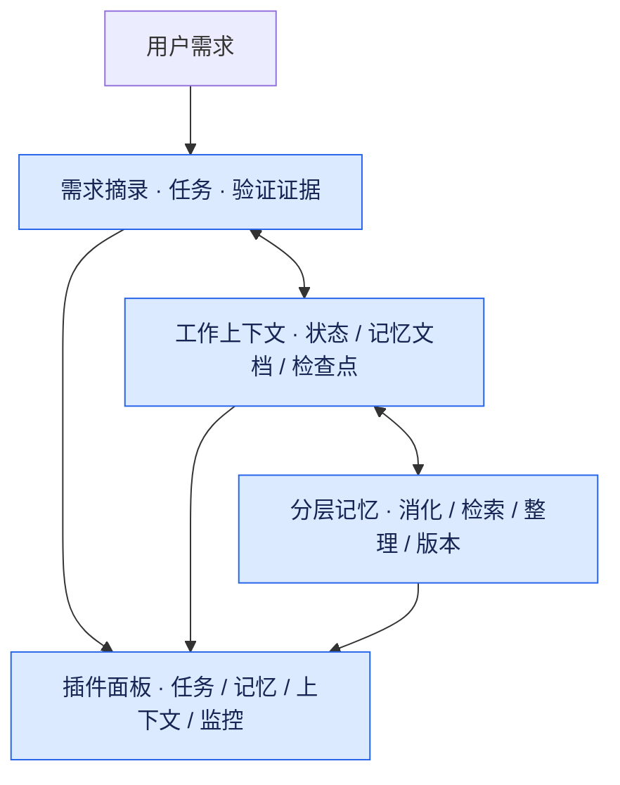

# trisoul_x

**为 DSH 补充分层记忆、上下文整理与任务验证。**

让任务保留需求来源，让验证对应执行结果，让记忆与上下文跟随工作持续更新。

可以直接安装到已有的 [DeepSeek Harness（DSH）](https://github.com/deepseek-ai/deepseek-harness) Web，继续使用原来的端口、模型配置与会话。Windows、macOS 和 Linux 使用同一套插件入口。

当前版本 **0.1.0**，适配 **DSH 0.1.5-rc.1**。这是持续迭代中的早期版本，DSH 依赖已固定到同一候选版本；升级宿主前需要重新验证兼容性。

## 核心能力

| 能力 | 实际行为 |
| --- | --- |
| 任务与验证 | 任务保留需求摘录和引用锚点；独立挂接测试或文字证据。修改任务会撤销完成状态和旧证据，任务及验证结果显示在同一面板。 |
| 分层记忆 | 按全局、跨项目、项目及会话范围组织；支持自动消化、检索、整理、编辑和版本恢复。 |
| 画布式上下文 | 保留近期事件和关键工作信息，对可整理区间生成检查点；支持检查点合并、事实探针与原文回捞。 |
| 运行监控 | 集中查看主任务和记忆、状态、压缩等后台调用的用量、缓存与耗时，追踪上下文变化和记忆注入记录。 |

## 工作方式

插件围绕当前任务维护需求记录、工作状态与长期记忆，通过区间整理减少上下文冗余，并保留回捞原文的入口。任务、记忆和上下文的变化都可在插件面板中查看。



## 安装到现有 DSH（推荐）

适用 **DSH 0.1.5-rc.1**，需要 Node.js ≥22.19、pnpm 11.21.0 和 Git。**Windows 使用 PowerShell 7（`pwsh`）**，无需 WSL；Python 验证文件需要另有 Python，`.sh` 文件需要 Bash。

先停止当前 DSH Web，在终端或 PowerShell 中安装：

```sh
dsh plugin --profile web add github:gulagala001/trisoul_x
```

然后按原来的方式重新启动 DSH，例如：

```sh
dsh web
```

打开这次启动打印的登录链接，继续使用原来的 **3080**（或自己配置的端口）。页面中会出现 X 的记忆、工作上下文、监控与设置；新建会话使用 `trisoul-x` Agent preset。已有模型和凭据沿用宿主配置，已有会话保持各自的 Agent preset。

如果原服务用了自定义 profile，把命令中的 `web` 替换为其名称；如果设置了 `DSH_HOME`，安装时必须使用同一个值。无需克隆仓库、手动构建或另外运行 `pnpm start`。

插件会将该 profile 的默认 Agent preset 设为 `trisoul-x`，并应用完整文件/命令访问、关闭执行审批的运行配置；profile 自己的覆盖配置优先于插件。

<details>
<summary>更新与卸载</summary>

停止服务后，重新执行安装命令可更新 GitHub 版本；再按原来的方式启动。

卸载：

```sh
dsh plugin --profile web remove trisoul_x
```

重启后恢复宿主配置。卸载不删除模型配置、凭据、会话或 X 的记忆文件；使用 `trisoul-x` preset 的旧会话需要重新安装插件后才能继续运行。

</details>

## 本地开发或独立试用

需要 **Node.js ≥22.19**、Git 和 **pnpm 11.21.0**。推荐使用 Node.js 24。尚未安装 pnpm 时，可运行 `npm install -g pnpm@11.21.0`。

```sh
git clone https://github.com/gulagala001/trisoul_x.git
cd trisoul_x
pnpm install --frozen-lockfile
pnpm build
pnpm start
```

1. 首次启动会创建独立的 `trisoul-x` profile，并安装本地插件。
2. 打开终端打印的**完整登录链接**。默认端口为 `3083`。
3. 在 DSH 的模型设置中添加自己的提供方、模型和凭据，在对话中选好模型。
4. 创建会话并选择工作目录；首次发送消息前，在输入区工具行选择记忆范围。
5. 通过“设置 → trisoul_x”调整后台模型与工作频率。

模型需要支持原生工具调用。仓库不附带模型账号、密钥、私人会话或记忆数据。模型的上下文窗口、输出上限和思考选项应按对应提供方的实际能力配置。

前台启动后，按 `Ctrl+C` 停止。macOS/Linux 可通过环境变量改变端口或数据目录：

```sh
PORT=3090 pnpm start
DSH_HOME=/absolute/path/to/x-data pnpm start
```

Windows PowerShell 可用 `$env:PORT = '3090'` 或 `$env:DSH_HOME = 'C:\x-data'` 设置环境变量，再运行 `pnpm start`。

<details>
<summary>链接本地开发代码，或在 macOS 后台打开</summary>

开发插件时，先在 X 源码目录安装依赖并构建，再将本地代码链接到目标 profile：

```sh
dsh plugin --profile YOUR_PROFILE add link:/absolute/path/to/trisoul_x
```

重启该 profile 后生效。插件 bundle 会将默认 Agent preset 设为 `trisoul-x`。

macOS 用户完成安装和构建后，也可执行：

```sh
node scripts/launch-macos.mjs
```

该脚本在后台启动本项目的 `3083` 服务，并用默认浏览器打开登录链接；已经运行时复用服务。日志写入 `data/dsh-stage.log`。关闭浏览器不会停止后台服务。仓库提供脚本，不包含预先安装的启动台应用。

</details>

## 日常使用

**记忆范围**在对话输入区工具行选择。完全版使用全局、跨项目与当前项目记忆；项目级只使用本项目记忆；会话级使用该会话的私有范围。首次发消息后范围绑定到会话，子代理继承范围。项目按 Git 根目录识别，同一仓库的子目录共享项目记忆。

**工作上下文**按任务、工作状态和记忆文档查看。任务中的摘录、锚点和证据可展开；`todo_write` 管理需求与完成状态，`verify_link` 独立负责证据关联、测试执行和撤销，二者共用记录。

**BT（Better Todo）**位于模型选择旁边，收纳两个独立的收尾提醒开关：待办完成提醒默认开启，验证完成提醒默认关闭。选择按会话保存，可随时更改；验证提醒包含缺少合格证据与文字证据复核。关闭提醒不影响任务清单和验证工具的使用。

**记忆页面**支持按内容、项目和层级筛选，查看当前版本、历史版本、召回与注入记录。可手动编辑、恢复或删除记录；自动整理保留用户手写记忆的归属信息。会话私有记忆不参与长期分片整理。

**监控页面**展示模型调用、输入输出用量、缓存和耗时，以及上下文的组成和变化。点击调用轨迹可查看详情。后台调用也计入用量，调低更新频率可减少这部分开销。

**设置页面**分为常用与高级。后台模型支持跟随主模型、统一配置、分别配置；频率提供三档和自定义值。更改后在后续步骤或批次生效。

默认采用维护者实际使用的配置：项目级记忆，后台统一跟随主模型，频率为“频繁”；上下文达到窗口的 50% 时进入压力判断，保留最近 30 条事件，启用事实探针、语义压缩和检查点合并。默认值不包含维护者的模型路由、密钥或本机路径，已有安装显式保存的设置继续优先。

<details>
<summary>默认频率与计数方式</summary>

| 档位 | 消化事件数 | 状态事件数 | 记忆文档最短步数 | 压缩间隔步数 | 最小整理区间 Token |
| --- | ---: | ---: | ---: | ---: | ---: |
| 频繁（默认） | 16 | 30 | 20 | 10 | 20,000 |
| 适中 | 32 | 60 | 30 | 20 | 40,000 |
| 较少 | 48 | 90 | 45 | 30 | 80,000 |

事件按模型回复、工具结果和用户消息计数；步数按主模型调用计数。阈值是最早触发时机，实际更新还取决于内容变化、后台完成和可整理区间。记忆轮巡、探针和旧消息退役等设置独立配置。

</details>

## 数据与维护

作为插件安装时，数据使用现有 DSH 的数据目录：默认 `~/.dsh/`（Windows 为用户目录下的 `.dsh`），或服务已有的 `DSH_HOME`。X 自身的记录位于其中的 `trisoul-x/`。只有仓库的独立试用脚本默认使用 `data/dsh/`。

| 路径（相对于数据目录） | 内容 |
| --- | --- |
| `settings.yaml` / `.credentials.yaml` | DSH 设置与本机凭据 |
| `profiles/<profile>/` | 当前 profile 与插件安装信息，通常是 `web` |
| `sessions/` | DSH 会话事件 |
| `trisoul-x/memory.json` | 插件记忆及版本 |
| `trisoul-x/sessions/` / `trisoul-x/curation.json` | 工作状态、监控记录与整理进度 |

`data/`、环境文件与运行日志已加入 Git 忽略规则。备份时停止服务并保存整个数据目录。本地开发代码更新后，重新运行 `pnpm install --frozen-lockfile` 和 `pnpm build`，再启动服务。

遇到 `dsh web authentication required` 时，重新打开当前服务打印的完整登录链接。首次启动需要下载 DSH profile 依赖；如果失败，先查看终端中的安装错误。

## 开发与验证

```sh
pnpm build
pnpm test
```

自动测试使用临时数据目录、本地模拟模型与真实 DSH profile，不需要模型密钥。覆盖提示词、任务锚点与证据、跨轮恢复、记忆范围与版本、后台消化与整理、状态更新、上下文压缩、事实探针和原文回捞。

Windows 的验证命令使用 PowerShell，支持直接关联 `.ps1` 文件；macOS/Linux 的自定义命令继续使用 Bash。停止验证时终止测试进程树。CI 在 Linux 和 Windows 上运行，包含 PowerShell 执行、失败结果与进程取消检查。

DSH CLI 仅作为本地开发依赖；宿主 SDK 声明为由 DSH 提供的 peer dependencies，避免安装插件时重复安装一套宿主及其原生依赖。

| 位置 | 职责 |
| --- | --- |
| `cordis.patch.yml` / `presets/` | 宿主安装补丁与 Agent 组合 |
| `src/index.mjs` / `src/dsh-agent.mjs` | 插件接入、事件与扩展工具 |
| `src/tasks.mjs` / `src/todolist.mjs` | 需求锚点、任务与验证记录 |
| `src/prompts.mjs` | 主模型与后台任务的提示词 |
| `src/hub.mjs` / `src/hub-store.mjs` | 记忆调度、存储、版本与监控 |
| `src/memory-context.mjs` / `src/state-zone.mjs` | 记忆检索、文档更新与状态提炼 |
| `src/canvas.mjs` / `src/probe.mjs` | 上下文整理、检查点与事实探针 |
| `src/client/` | 设置、输入区与侧栏页面 |
| `scripts/` / `test/` | 构建、启动与测试 |

提示词说明与变更理由见 [PROMPT_CHANGES.md](PROMPT_CHANGES.md)，项目协作约定见 [AGENTS.md](AGENTS.md)。报告问题时，请提供 Node.js/DSH 版本、复现步骤和脱敏后的错误信息。

## 来源与许可

核心机制与提示词源自 trisoul；宿主与基础 Agent preset 基于 DeepSeek Harness。项目代码许可暂未指定。上游 MIT 许可和来源信息见 [THIRD_PARTY_NOTICES.md](THIRD_PARTY_NOTICES.md)。
