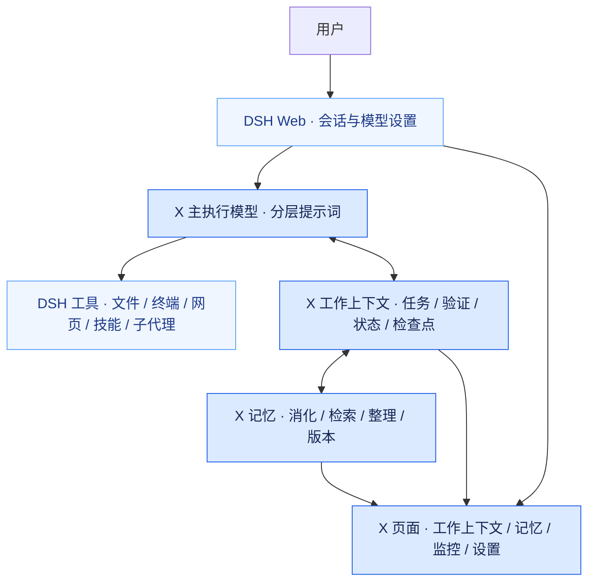

# trisoul_x

**面向持续任务的 DSH 通用 Agent 插件。**

让任务保留需求来源，让验证对应执行结果，让记忆与上下文跟随工作持续更新。

trisoul_x 由 trisoul 重构而来，将三官的执行原则融合进一个主执行模型，保留分层提示词、任务与验证、画布式上下文和分层记忆。文件、终端、网页、技能、会话与按需子代理由 [DeepSeek Harness（DSH）](https://github.com/deepseek-ai/deepseek-harness) 提供。

**独立仓库 · DSH 插件 · 单主模型 · 原生工具调用**

当前版本 **0.1.0**，适配 **DSH 0.1.5-rc.1**。这是持续迭代中的早期版本，DSH 依赖已固定到同一候选版本；升级宿主前需要重新验证兼容性。

## 核心能力

| 能力 | 实际行为 |
| --- | --- |
| 分层提示词 | 融合 trisoul 的三官原文；项目指令、技能目录、工具说明和动态工作信息由宿主与插件分层组装。 |
| 任务与验证 | 任务保留需求摘录和引用锚点；独立挂接测试或文字证据。修改任务会撤销完成状态和旧证据，任务及验证结果显示在同一面板。 |
| 分层记忆 | 按全局、跨项目、项目及会话范围组织；支持自动消化、检索、整理、编辑和版本恢复。 |
| 画布式上下文 | 保留近期事件和关键工作信息，对可整理区间生成检查点；支持检查点合并、事实探针与原文回捞。 |
| 按需子代理 | 根据任务调用、继续、查询或停止子代理，复用 DSH 的委派与工作流能力。 |
| 可查看的运行过程 | 蓝色系设置、记忆、工作上下文和监控面板；查看调用、Token 用量、缓存、耗时、上下文构成及记忆注入记录。 |

“单主模型”指主任务的执行方式。记忆消化、状态提炼与上下文整理仍可在后台调用模型；可以跟随主模型，也可以统一或分别指定后台模型。

## 与 DSH 的关系

X 通过插件和 Agent preset 接入 DSH，使用宿主的模型执行循环和 Web 框架。仓库包含启动脚本，可自动创建独立 profile 并安装本地插件，无需修改 DSH 源码。



## 快速开始

需要 **Node.js ≥22.19**、Git 和 **pnpm 11.21.0**。推荐使用 Node.js 24。尚未安装 pnpm 时，可运行 `npm install -g pnpm@11.21.0`。

```sh
git clone https://github.com/gulagala001/trisoul_x.git
cd trisoul_x
pnpm install --frozen-lockfile
pnpm build
pnpm start
```

1. 首次启动会创建独立的 `trisoul-x` profile，并安装本地插件。
2. 打开终端打印的**完整登录链接**。默认端口为 `3083`。
3. 在 DSH 的模型设置中添加自己的提供方、模型和凭据，在对话中选好模型。
4. 创建会话并选择工作目录；首次发送消息前，在输入区工具行选择记忆范围。
5. 通过“设置 → trisoul_x”调整后台模型与工作频率。

模型需要支持原生工具调用。仓库不附带模型账号、密钥、私人会话或记忆数据。模型的上下文窗口、输出上限和思考选项应按对应提供方的实际能力配置。

前台启动后，按 `Ctrl+C` 停止。macOS/Linux 可通过环境变量改变端口或数据目录：

```sh
PORT=3090 pnpm start
DSH_HOME=/absolute/path/to/x-data pnpm start
```

仓库的默认运行配置会设置完整文件与命令访问，并关闭执行审批；安装到已有 profile 时也会应用这组设置。

<details>
<summary>安装到已有 DSH，或在 macOS 后台打开</summary>

已有 **DSH 0.1.5-rc.1** 时，先在 X 源码目录安装依赖并构建，再将插件链接到目标 profile：

```sh
dsh plugin --profile YOUR_PROFILE add link:/absolute/path/to/trisoul_x
```

重启该 profile 后生效。插件 bundle 会将默认 Agent preset 设为 `trisoul-x`。

macOS 用户完成安装和构建后，也可执行：

```sh
node scripts/launch-macos.mjs
```

该脚本在后台启动本项目的 `3083` 服务，并用默认浏览器打开登录链接；已经运行时复用服务。日志写入 `data/dsh-stage.log`。关闭浏览器不会停止后台服务。仓库提供脚本，不包含预先安装的启动台应用。

</details>

## 日常使用

**记忆范围**在对话输入区工具行选择。完全版使用全局、跨项目与当前项目记忆；项目级只使用本项目记忆；会话级使用该会话的私有范围。首次发消息后范围绑定到会话，子代理继承范围。项目按 Git 根目录识别，同一仓库的子目录共享项目记忆。

**工作上下文**按任务、工作状态和记忆文档查看。任务中的摘录、锚点和证据可展开；`todo_write` 管理需求与完成状态，`verify_link` 独立负责证据关联、测试执行和撤销，二者共用记录。收尾时会对未完成任务、缺少证据和仅文字证据进行提醒或复核。

**记忆页面**支持按内容、项目和层级筛选，查看当前版本、历史版本、召回与注入记录。可手动编辑、恢复或删除记录；自动整理保留用户手写记忆的归属信息。会话私有记忆不参与长期分片整理。

**监控页面**展示模型调用、输入输出用量、缓存和耗时，以及上下文的组成和变化。点击调用轨迹可查看详情。后台调用也计入用量，调低更新频率可减少这部分开销。

**设置页面**分为常用与高级。后台模型支持跟随主模型、统一配置、分别配置；频率提供三档和自定义值。更改后在后续步骤或批次生效。

<details>
<summary>默认频率与计数方式</summary>

| 档位 | 消化事件数 | 状态事件数 | 记忆文档最短步数 | 压缩间隔步数 | 最小整理区间 Token |
| --- | ---: | ---: | ---: | ---: | ---: |
| 频繁 | 16 | 30 | 20 | 10 | 20,000 |
| 适中（默认） | 32 | 60 | 30 | 20 | 40,000 |
| 较少 | 48 | 90 | 45 | 30 | 80,000 |

事件按模型回复、工具结果和用户消息计数；步数按主模型调用计数。阈值是最早触发时机，实际更新还取决于内容变化、后台完成和可整理区间。记忆轮巡、探针和旧消息退役等设置独立配置。

</details>

文件交付使用 DSH 原生 `present`，在宿主侧栏预览。网页搜索需要额外配置 DSH 搜索服务；聊天模型的密钥不会自动成为搜索凭据。MCP 服务同样在 DSH 宿主中配置。

## 数据与维护

默认数据目录为 `data/dsh/`，与其他 DSH 安装隔离；指定 `DSH_HOME` 时以该目录为准。

| 路径（相对于数据目录） | 内容 |
| --- | --- |
| `settings.yaml` / `.credentials.yaml` | DSH 设置与本机凭据 |
| `profiles/trisoul-x/` | 独立 profile 与插件安装信息 |
| `sessions/` | DSH 会话事件 |
| `trisoul-x/memory.json` | 插件记忆及版本 |
| `trisoul-x/sessions/` / `trisoul-x/curation.json` | 工作状态、监控记录与整理进度 |

`data/`、环境文件与运行日志已加入 Git 忽略规则。备份时停止服务并保存整个数据目录。更新代码后重新运行 `pnpm install --frozen-lockfile` 和 `pnpm build`，再启动服务。

遇到 `dsh web authentication required` 时，重新打开当前服务打印的完整登录链接。首次启动需要下载 DSH profile 依赖；如果失败，先查看终端中的安装错误。

## 开发与验证

```sh
pnpm build
pnpm test
```

自动测试使用临时数据目录、本地模拟模型与真实 DSH profile，不需要模型密钥。覆盖提示词原文、任务锚点与证据、跨轮恢复、记忆范围与版本、后台消化与整理、状态更新、上下文压缩、事实探针、原文回捞和原生文件交付。

| 位置 | 职责 |
| --- | --- |
| `cordis.patch.yml` / `presets/` | 宿主安装补丁与 Agent 组合 |
| `src/index.mjs` / `src/dsh-agent.mjs` | 插件接入、事件与扩展工具 |
| `src/tasks.mjs` / `src/todolist.mjs` | 需求锚点、任务与验证记录 |
| `src/prompts.mjs` | 融合后的分层提示词 |
| `src/hub.mjs` / `src/hub-store.mjs` | 记忆调度、存储、版本与监控 |
| `src/memory-context.mjs` / `src/state-zone.mjs` | 记忆检索、文档更新与状态提炼 |
| `src/canvas.mjs` / `src/probe.mjs` | 上下文整理、检查点与事实探针 |
| `src/client/` | 设置、输入区与侧栏页面 |
| `scripts/` / `test/` | 构建、启动与测试 |

提示词迁移记录见 [PROMPT_CHANGES.md](PROMPT_CHANGES.md)，包含原文、新文和改动原因；项目协作约定见 [AGENTS.md](AGENTS.md)。报告问题时，请提供 Node.js/DSH 版本、复现步骤和脱敏后的错误信息。

## 来源与许可

核心机制与提示词源自 trisoul；宿主与基础 Agent preset 基于 DeepSeek Harness。项目代码许可暂未指定。上游 MIT 许可和来源信息见 [THIRD_PARTY_NOTICES.md](THIRD_PARTY_NOTICES.md)。
