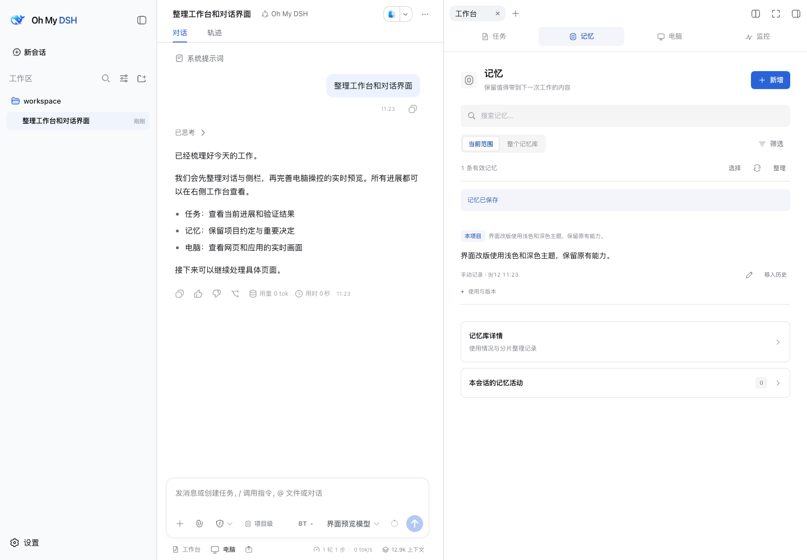
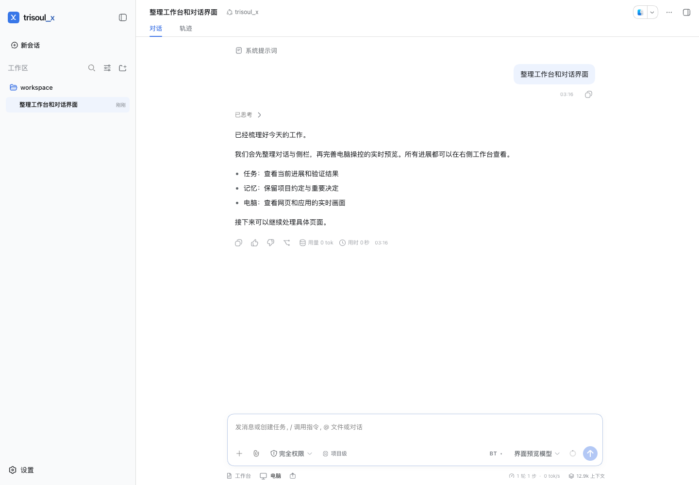
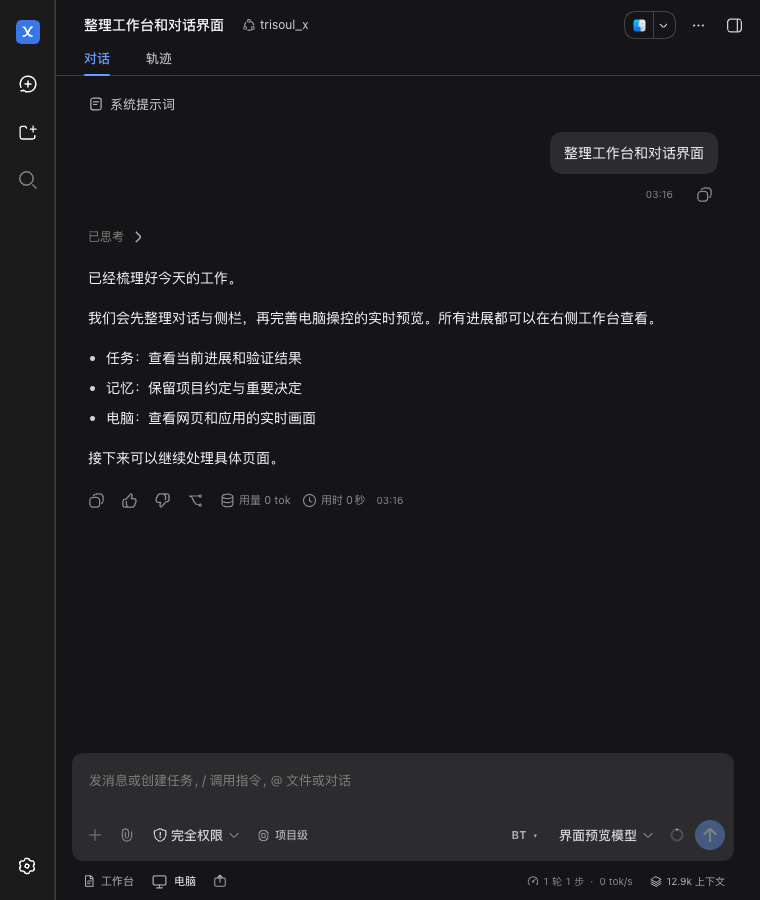
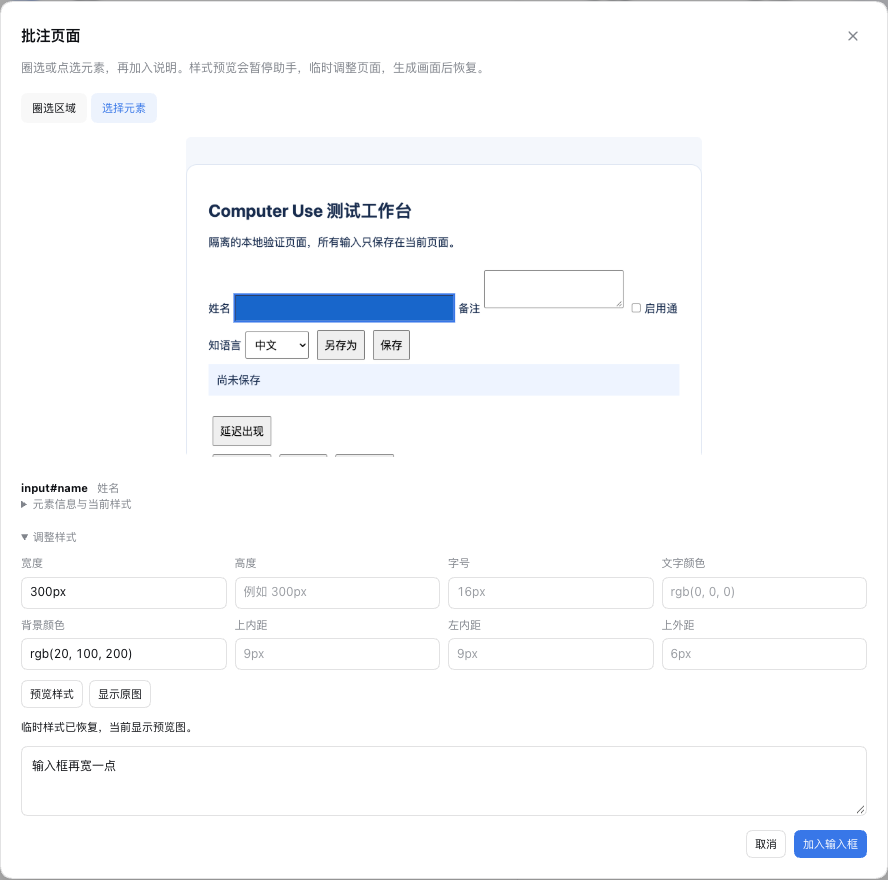

<p align="center">
  
</p>

<h1 align="center">Oh My DSH</h1>

<p align="center">
  <strong>让 Agent 记住项目，跟进任务，操作网页与应用。</strong>
</p>

<p align="center">
  分层记忆 · 上下文整理 · 任务验证 · Computer Use<br />
  为 DeepSeek Harness 打造的单主模型插件
</p>

<p align="center">
  <a href="https://github.com/gulagala001/oh-my-dsh/commits/main/"></a>
  <a href="https://github.com/deepseek-ai/deepseek-harness"></a>
  <a href="#support"></a>
</p>

<p align="center">
  <a href="#quickstart"><strong>快速开始</strong></a> ·
  <a href="#features">功能亮点</a> ·
  <a href="#computer-use">Computer Use</a> ·
  <a href="docs/usage.md">使用指南</a> ·
  <a href="https://github.com/gulagala001/oh-my-dsh/issues">反馈问题</a>
</p>

<p align="center">
  
</p>

Oh My DSH 把任务、记忆、电脑和监控放进同一个工作台。助手可以保存项目约定，整理长对话，关联任务与验证结果，也能打开网页或操作 Mac 应用。你可以随时查看它记住了什么、做到了哪一步，以及正在操作的画面。

作为 [DeepSeek Harness（DSH）](https://github.com/deepseek-ai/deepseek-harness) 插件运行，沿用已有的模型配置、会话、文件、工具与技能。

<a id="quickstart"></a>

## 快速开始

已有 **DSH 0.1.5-rc.1 Web**？停止服务后安装插件：

```sh
dsh plugin --profile web add github:gulagala001/oh-my-dsh
```

按原来的方式启动：

```sh
dsh web
```

打开启动时打印的登录链接，新建会话并选择 **`trisoul-x`**。输入区下方的 **工作台** 和 **电脑** 就是主要入口。

为兼容已有安装，插件 ID 与 Agent preset 继续使用 `trisoul_x` / `trisoul-x`。

需要 **Node.js ≥22.19、pnpm 11.21.0 和 Git**；Windows 使用 **PowerShell 7**。模型需支持原生工具调用，理解截图还需要图像输入能力。自定义 profile 和 `DSH_HOME` 应沿用原配置。

插件会设置 X 为默认 Agent preset，并应用完整文件／命令访问、关闭执行审批的配置；profile 自己的覆盖配置优先。

[从源码试用](docs/usage.md#本地开发或独立试用) · [更新与卸载](docs/usage.md#安装到现有-dsh推荐) · [模型与后台配置](docs/usage.md#日常使用)

<a id="features"></a>

## 为持续工作的 Agent 准备

<table>
  <tr>
    <td width="50%" valign="top">
      <h3>记住项目约定</h3>
      <p>全局、跨项目、项目与会话分层记忆。自动消化、检索与整理，也可以手动编辑、追溯版本和恢复。</p>
    </td>
    <td width="50%" valign="top">
      <h3>让长对话继续工作</h3>
      <p>保留近期事件与关键工作信息，将可整理区间收纳为检查点；需要细节时，仍能回捞原文。</p>
    </td>
  </tr>
  <tr>
    <td width="50%" valign="top">
      <h3>让任务有据可查</h3>
      <p>任务对应需求摘录与锚点，验证关联测试或文字证据。修改任务时撤销完成状态与旧证据，进度和结果一起查看。</p>
    </td>
    <td width="50%" valign="top">
      <h3>操作网页与应用</h3>
      <p>控制内置浏览器、已连接的 Chrome 标签与 Mac 应用。读取控件、截图、点击和输入，在实时预览中查看进展。</p>
    </td>
  </tr>
  <tr>
    <td width="50%" valign="top">
      <h3>用画面说明问题</h3>
      <p>分享窗口、圈选页面、标注元素，预览宽高与颜色等样式变化；把截图和说明加入草稿，继续和助手讨论。</p>
    </td>
    <td width="50%" valign="top">
      <h3>看清每一步的开销</h3>
      <p>集中查看主模型与后台调用的 Token 用量、缓存和耗时，追踪上下文变化以及记忆召回、注入记录。</p>
    </td>
  </tr>
</table>

### 一个工作台，四个入口

**任务 · 记忆 · 电脑 · 监控** 复用同一个右侧标签，切换时保留未保存的编辑。界面采用 DSH 与 Codex 的融合风格，统一浅色／深色主题与窄窗布局；连续电脑操作默认折叠，截图按需展开。

输入区保留记忆范围和 **BT（Better Todo）**：待办完成提醒默认开启，验证完成提醒默认关闭，两个开关按会话独立保存。

<details>
<summary>查看浅色对话与深色窄窗截图</summary>

<table>
  <tr>
    <td width="63%" valign="top"><p>浅色主题 · 对话与工具栏</p></td>
    <td width="37%" valign="top"><p>深色主题 · 窄窗布局</p></td>
  </tr>
</table>

</details>

<a id="computer-use"></a>

## 让助手操作网页与应用

在输入区用 **`@Browser`**、已连接的 **`@Chrome`** 或应用引用选择目标，然后描述任务：

> 打开这个表单，填写我提供的内容，完成后截图并保留页面。

助手选择目标后，对话页内自动出现实时预览。多个网页或应用以卡片堆叠，点击即可进入对应窗口；你也可以停止助手，手动操作后再恢复控制。


- **实时观察**：画面与助手光标同步显示；停止后仍可看图，也可选择独立弹出预览。
- **浏览器协作**：地址栏、标签页、画面内接管、上传下载和页面截图；已有 Chrome 通过扩展连接。
- **文件交付**：导出当前页 MHTML 快照，保存已加载的图片、字体、样式与视频资源，结果成为持久会话附件。
- **页面工具**：兼容的 Chromium 153+ 可发现并调用网页公开的 WebMCP 工具。

首次使用，打开 **电脑 → 运行环境与权限** 检查连接。Mac 桌面控制需要 **macOS 14+**、辅助功能与屏幕录制权限；其他平台的支持范围见下方。

### 圈出问题，再给出修改方向

用 **分享窗口** 把 Mac 窗口截图与文字加入草稿；用 **批注页面** 圈选区域或点选元素，附上修改说明。元素批注支持跨源嵌套框架。

选择元素后，可预览宽高、字号、颜色与间距。插件在真实网页临时应用样式，采集图片后恢复；把预览交给助手后，再继续修改项目源码。

<details>
<summary>查看页面批注与样式预览</summary>

<p align="center">
  
</p>

截图、元素上下文与说明加入现有草稿，由你检查后发送。临时样式预览本身不会修改源码。

</details>

[Computer Use 使用说明](docs/usage.md#computer-use预览版) · [已实现范围与验证记录](COMPUTER_USE_HANDOFF.md)

<a id="support"></a>

## 当前支持范围

当前为 **0.1.1 预览版**，依赖固定到 **DSH 0.1.5-rc.1**；升级宿主前需重新验证兼容性。

| 功能 | 当前支持 |
| --- | --- |
| 任务、记忆、上下文与监控 | Windows、macOS、Linux 共用插件入口，独立于桌面控制。 |
| 内置浏览器 | 已实现独立配置与 Chrome／Chromium 操控；完整交互证据主要来自 macOS，Windows／Linux 仍需各自实机验收。 |
| 已有 Chrome 扩展 | 安装器支持 macOS／Linux；macOS 已有连接与操作验证，Windows 安装桥接尚未实现。 |
| 原生桌面与窗口分享 | 当前仅实现 macOS 14+；开发版本机编译需要 Apple Command Line Tools。Windows／Linux 原生服务尚未实现。 |
| 独立弹出预览 | 需要 Document Picture-in-Picture 支持；默认页内预览不依赖该 API。 |

锁屏使用、全局窗口分享快捷键、复杂 CSS 命中、完整跨应用兼容和部分导出能力仍待完善。详细边界见 [Computer Use 基线](COMPUTER_USE_BASELINE.md)。

<details>
<summary>近期更新 · 2026-09-12</summary>

- 统一工作台和对话工具栏，完善浅色／深色主题与窄窗布局。
- 新增网页与 Mac 应用操控、多目标堆叠预览、窗口分享、批注和样式预览。
- 接入页面／素材导出与 WebMCP。
- 0.1.1 同时修复原版模式与 X 共存时的任务投影冲突，以及切换模式后后台功能的判断问题；保留任务摘录、锚点和验证记录。

</details>

## 文档与参与

- [使用与开发指南](docs/usage.md)：安装、日常操作、模型与频率配置、数据备份及测试。
- [Computer Use 当前交接](COMPUTER_USE_HANDOFF.md)：实现进展、已知问题与实测边界。
- [提示词变更记录](PROMPT_CHANGES.md)：主模型及后台任务提示词的调整依据。
- [提交问题或建议](https://github.com/gulagala001/oh-my-dsh/issues)：请附上 DSH／Node.js 版本、复现步骤与脱敏错误；代码贡献前请阅读 [项目约定](AGENTS.md)。

## 来源与许可

核心机制与提示词源自 trisoul；宿主与基础 Agent preset 基于 DeepSeek Harness。项目代码许可暂未指定。上游许可和来源见 [THIRD_PARTY_NOTICES.md](THIRD_PARTY_NOTICES.md)。

<sub>截图摄于 2026-09-12，来自实际 DSH 界面的隔离测试会话，网页与窗口内容均为测试示例。</sub>
