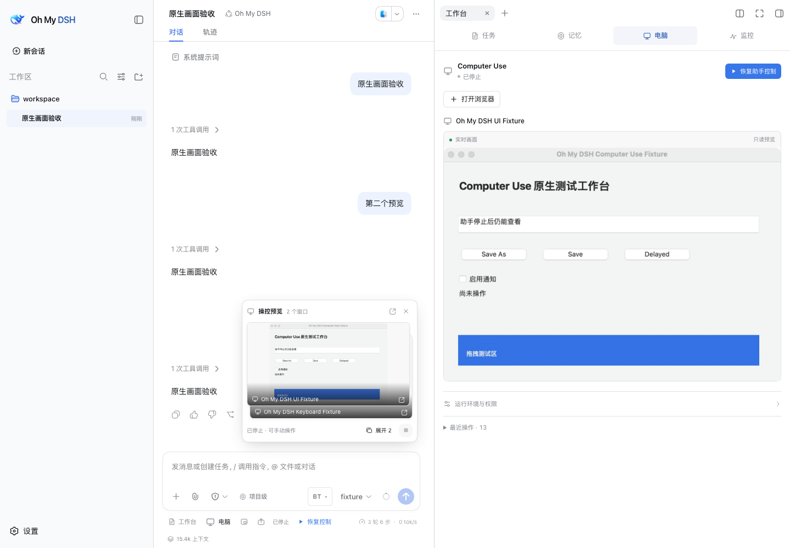

# OpenCU

**让 DSH 助手操作浏览器和桌面应用。**

OpenCU 从 [Oh My DSH](https://github.com/gulagala001/oh-my-dsh) 的 Computer Use 提取而来，提供相同的操控工具、实时预览和接管体验，可以独立安装到 DSH。Oh My DSH 继续集成全部能力，并直接复用 OpenCU 的实现。

## 安装

需要 **DSH 0.1.5-rc.1 Web、Node.js ≥22.19、pnpm 11.23.0 和 Git**。先停止 DSH 服务，再运行：

```sh
dsh plugin --profile web add github:gulagala001/opencu
dsh web
```

打开启动时的登录链接，继续使用已有 Agent preset。在输入区点击 **电脑**，或通过 `@Browser`、`@Chrome` 和应用引用选择目标：

> 打开这个表单，填写我提供的内容，检查结果并保留页面。

OpenCU 沿用 DSH 的模型、会话、工具权限和审批配置，不更改默认 Agent。需要看图操作时请选择支持图片输入的模型。自定义 profile 或 `DSH_HOME` 应沿用原配置。

## 能做什么

- **浏览器和桌面应用**：发现目标，读取控件，截图、点击、滚动、拖拽、中文输入和复制粘贴。
- **实时预览**：对话内的画面堆叠、助手光标、独立预览窗口，以及停止、接管和恢复。
- **浏览器工作区**：标签、导航、查找、历史、下载、设备尺寸与响应式预览。
- **页面批注和窗口分享**：圈选区域、选择页面元素、预览样式变化，把截图与说明加入草稿。
- **文件交付**：导出 MHTML 页面快照和已加载素材，保存为 DSH 持久会话附件。
- **页面工具**：在兼容 Chromium 153+ 中发现并调用页面公开的 WebMCP 工具。

[完整使用指南](docs/usage.md) · [Windows 安装与自检](docs/windows.md)



## 平台

| 平台 | 运行条件与范围 |
| --- | --- |
| Windows | PowerShell 7；浏览器、Chrome 扩展与原生桌面控制；桌面运行时使用 .NET 10，首次源码构建需要对应 SDK |
| macOS | 桌面控制需要 macOS 14+、辅助功能与屏幕录制权限；源码构建需要 Apple Command Line Tools |
| Linux | 内置浏览器；本版本不提供 Linux 原生桌面控制 |

首次使用打开 **电脑 → 运行环境与权限**，按需安装当前平台运行时与浏览器扩展。实际应用兼容性以目标设备为准。单屏 Windows 125%、150%、200% 属于支持范围；多屏混合缩放后置。后台操控、锁屏和应用特有控件存在平台差异，见使用指南。

## 与 Oh My DSH 一起使用

- **只装 OpenCU**：获得 Computer Use，保留 DSH 原有工作方式。
- **只装 Oh My DSH 1.1+**：自动带入 OpenCU，仍是完整整合版。
- **两个都装（Oh My DSH 1.1+）**：共用一套运行时、工具和预览；电脑功能进入 Oh My 工作台。卸载其中一个后，另一个仍可使用。

为了延续已有安装，数据默认仍位于 `DSH_HOME/trisoul-x/computer-use/`，扩展、原生程序和内部协议保留已有标识。部分系统安装界面仍显示 **Oh My DSH Computer Use**。独立版与整合版不需要重复授权或另建数据副本。

OpenCU 配置位于 DSH 的 `opencu` 设置区。未显式设置的字段继承已有 Oh My DSH Computer Use 配置；显式 OpenCU 设置优先。浏览器路径、原生运行时路径和数据目录变更后重启 DSH。

## 更新与卸载

先停止服务，再运行对应命令，然后重新启动 `dsh web`：

```sh
dsh plugin --profile web add github:gulagala001/opencu
dsh plugin --profile web remove opencu
```

上述两个命令分别用于更新和卸载，不需要一起执行。插件卸载保留会话和本地数据。移除浏览器连接、运行时及系统权限使用 **运行环境与权限** 中的对应操作；另一个插件仍使用 Computer Use 时请保留运行时。

## 源码开发

```sh
git clone https://github.com/gulagala001/opencu.git
cd opencu
pnpm install --frozen-lockfile
pnpm build
pnpm exec playwright install chromium
pnpm test
pnpm start
```

`pnpm start` 默认使用仓库下 `data/dsh/` 的独立 DSH 配置，也可设置 `DSH_HOME`。测试使用独立浏览器配置；原生桌面专项按平台与环境条件运行。Windows 自动化配置见 `.github/workflows/windows-computer-use.yml`。

`src/integration.mjs` 与 `src/client/computer-use.jsx` 提供整合入口；浏览器、原生服务、扩展和平台测试都在此仓库维护。Oh My DSH 通过固定版本依赖复用，不维护另一份实现。

第三方许可见 [THIRD_PARTY_NOTICES.md](THIRD_PARTY_NOTICES.md)。
